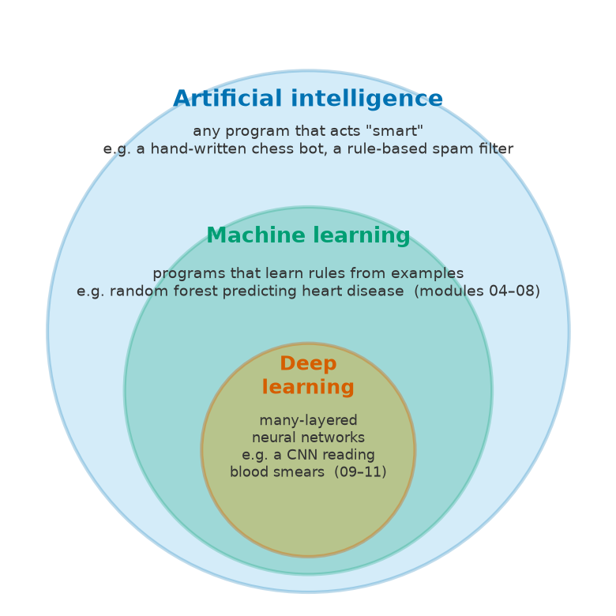
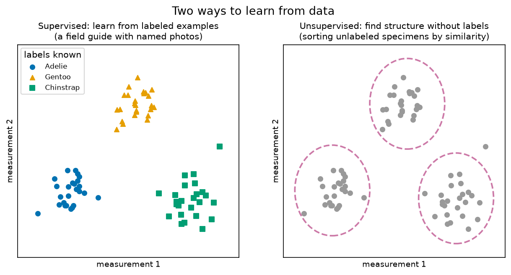
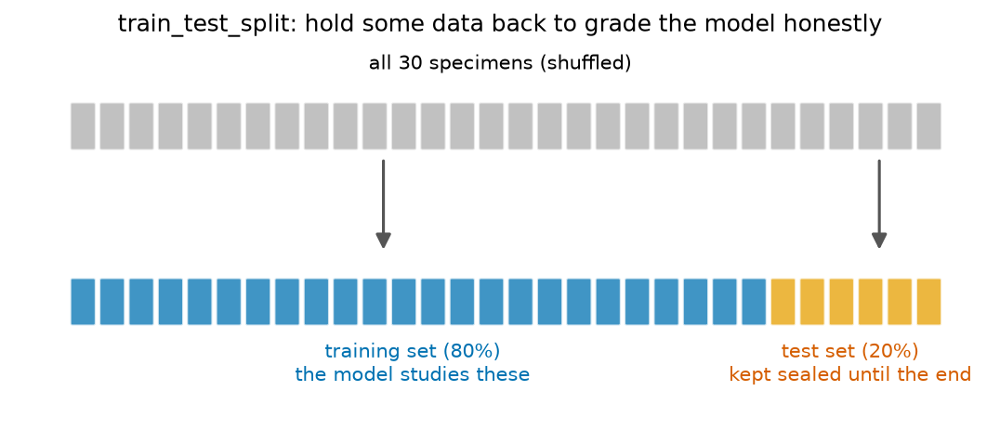
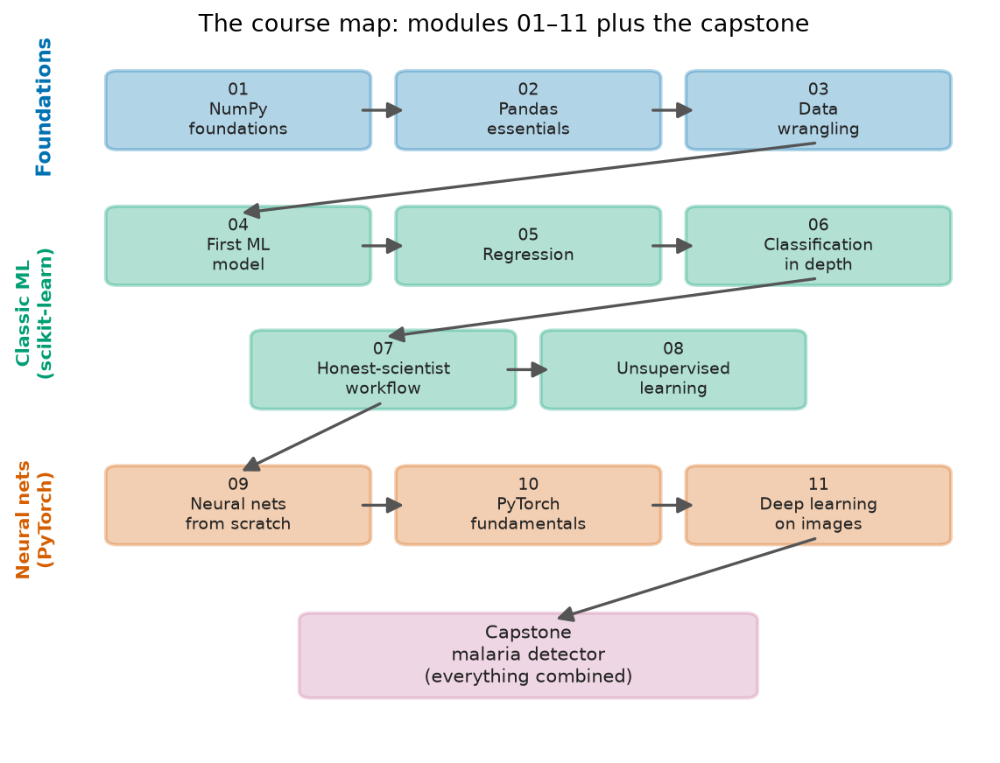

# The big picture — what even is machine learning?

*Read this before Module 04. No code here — just the map, so that when the modules zoom in on one technique you always know where you are.*

## Programs that learn from examples

A normal computer program is a recipe a human wrote down: *if the email contains "FREE MONEY", mark it as spam*. Somebody had to think of that rule.

**Machine learning** flips this around. Instead of writing the rule, you show the computer lots of **examples** — thousands of emails already sorted into spam and not-spam — and the computer works out the rule itself. The result is called a **model**: a fitted rule, learned from data.

You've already met this idea in biology. A **growth curve** is a model: nobody hand-wrote "a bacterial culture has exactly this density at hour 7" — you measured many cultures at many time points and fitted a curve through the data. Now the curve *predicts* density at time points you never measured. Every machine-learning model in this course is that same move, scaled up: fit a rule to measured examples, then use it on new cases.

## AI, machine learning, deep learning — three nested circles

These three terms get used interchangeably in the news, but they're nested, like taxonomy ranks:

- **Artificial intelligence** is the big, vague outer circle: any program that does something we'd call "smart". A chess bot following hand-written strategy rules is AI, but it never learns anything.
- **Machine learning** is the subset where the program *learns its rules from data*. Everything in this course lives here. Modules 04–08 use scikit-learn's classic ML tools: k-nearest neighbors, linear and logistic regression, decision trees, random forests, clustering, PCA.
- **Deep learning** is the subset of ML that uses **neural networks** with many layers — the technology behind image recognition, protein-structure prediction (AlphaFold), and chatbots. Modules 09–11 and the capstone live here.

So: every deep-learning system is machine learning, and every machine-learning system is AI — but not the other way around. Like: every mammal is a vertebrate, every vertebrate is an animal.

## Supervised vs unsupervised — do you have the answers?

The biggest fork in machine learning is whether your examples come with **labels** (the answers) or not.

**Supervised learning** is learning from labeled examples — like learning bird identification from a **field guide with labeled photos**. Each photo says "this is a Gentoo". After studying enough labeled photos, you can identify a bird the guide never showed you. In ML terms: each example has measured **features** (flipper length, bill depth…) and a known **label** (the species), and the model learns to map features → label. Modules 04–07 and 09–11 are supervised.

**Unsupervised learning** has no labels — like being handed a **drawer of unlabeled specimens** and asked to sort them into piles by similarity. Nobody tells you what the piles are, or even how many there should be; the structure has to emerge from the measurements themselves. This is exactly how biologists find cell types in single-cell RNA-seq data. Module 08 covers this: clustering (finding the piles) and PCA (making a 2-D map of high-dimensional measurements).

## Classification vs regression — which kind, or how much?

Within supervised learning there's a second fork, based on what kind of answer you want:

- **Classification** answers *"which kind?"* — the label is a category. Which species is this penguin? Does this patient have heart disease, yes or no? Is this blood cell parasitized? (Modules 04, 06, 07, 11, capstone.)
- **Regression** answers *"how much?"* — the label is a number. What is this penguin's body mass in grams? (Module 05.)

Same workflow, different output. A diagnostic test is classification; estimating gestational age from an ultrasound measurement is regression.

## The train/test idea — the rule you never break

Here's the trap that makes ML genuinely tricky, and the single most important idea in this course.

A student who **memorizes the answer key** scores 100% on that exact exam — and it proves nothing about whether they learned any biology. Models can memorize too: a flexible enough model can fit its training examples perfectly while having learned nothing general. That failure is called **overfitting**, and you can't detect it by re-asking questions the model has already seen.

The fix is simple and non-negotiable: before any learning happens, **split your data**.

The model trains only on the **training set**. The **test set** stays sealed — like samples locked in the −80 °C freezer — until the very end, when it becomes the final exam: questions the model has never seen. Test-set performance is the only honest estimate of how the model will do in the real world. Module 04 introduces this, and Module 07 builds the full "honest scientist" protocol around it (cross-validation, pipelines, and the ways information can quietly leak from test to train).

## Where deep learning fits — and why it needs so much data

Classic ML models learn from features *you* chose and measured: someone decided flipper length was worth recording. Deep learning's superpower is learning **from raw data** — pixels, sequences, sound — inventing its own features along the way. Show a **convolutional neural network** enough blood-smear photos and it discovers, on its own, what a *Plasmodium* parasite looks like. Nobody programs in "purple blob".

That superpower has a price. A neural network has thousands to millions of adjustable **weights**, and pinning down that many knobs takes a lot of examples — with only a few hundred, a big network just memorizes them (overfitting again). Rule of thumb you'll see proven in Module 10: on 303 heart-disease patients, a neural network barely matches a random forest; on 70,000 handwritten digits (Module 11) or 27,558 cell photos (capstone), deep learning pulls decisively ahead. Small tabular dataset → classic ML. Huge pile of raw images → deep learning.

## The map of this course

Full module-by-module detail lives in the [curriculum outline](curriculum.md); here is the shape of the journey:

**Foundations — speaking data.**
[Module 01](../modules/01-numpy-foundations/README.md) (NumPy: arrays and vectorized math, on 150 iris flowers), [Module 02](../modules/02-pandas-essentials/README.md) (pandas: real tables with missing values, on 344 Palmer penguins), and [Module 03](curriculum.md#module-03--data-wrangling-with-pandas) (reshaping, merging, and dates, on worldwide COVID-19 case counts).

**Classic machine learning — scikit-learn.**
[Module 04](curriculum.md#module-04--your-first-machine-learning-model) is the conceptual heart: features, labels, train/test split, and a first classifier that identifies penguin species. [Module 05](curriculum.md#module-05--regression-predicting-numbers) predicts numbers (penguin body mass) and shows you your first overfit. [Module 06](curriculum.md#module-06--classification-in-depth-when-accuracy-lies) diagnoses heart disease and shows why accuracy alone lies — confusion matrices, sensitivity/specificity, ROC curves, decision trees, random forests. [Module 07](curriculum.md#module-07--the-honest-scientist-workflow) is sterile technique for ML: cross-validation, pipelines, avoiding leakage, on breast-tumor data. [Module 08](curriculum.md#module-08--unsupervised-learning-patterns-without-answers) hides the labels: clustering, dendrograms read like phylogenies, PCA.

**Neural networks — PyTorch.**
[Module 09](curriculum.md#module-09--neural-networks-from-scratch) builds a neural network in bare NumPy — the difference between using a thermocycler and knowing what PCR actually does. [Module 10](curriculum.md#module-10--pytorch-fundamentals) rebuilds it with power tools: tensors, autograd, and the training loop that never changes from here to GPT. [Module 11](curriculum.md#module-11--deep-learning-on-images) teaches a network to see, with convolutions on 70,000 handwritten digits.

**[Capstone](curriculum.md#capstone-project--the-malaria-detector-projects01-malaria-detector) — the malaria detector.**
Everything combined: 27,558 real microscope photos of blood cells, half parasitized, half healthy. Explore like Module 02, split honestly like Module 07, baseline like Module 06, CNN like Module 11, and evaluate like a clinician: which error is worse — a false alarm, or a sick patient sent home?

## While you work

Keep the [glossary](glossary.md) open in a tab — every jargon term in the course is there in plain language with a biology analogy. And the cheat sheets ([pandas](cheatsheets/pandas.md) · [scikit-learn](cheatsheets/sklearn.md) · [PyTorch](cheatsheets/pytorch.md)) are for mid-exercise "how do I write that again?" moments.

## The one idea to remember

> **A model is a rule fitted to examples — and you only find out if it truly learned by testing it on examples it has never seen.**
> Everything else in this course is technique built around that one sentence.
