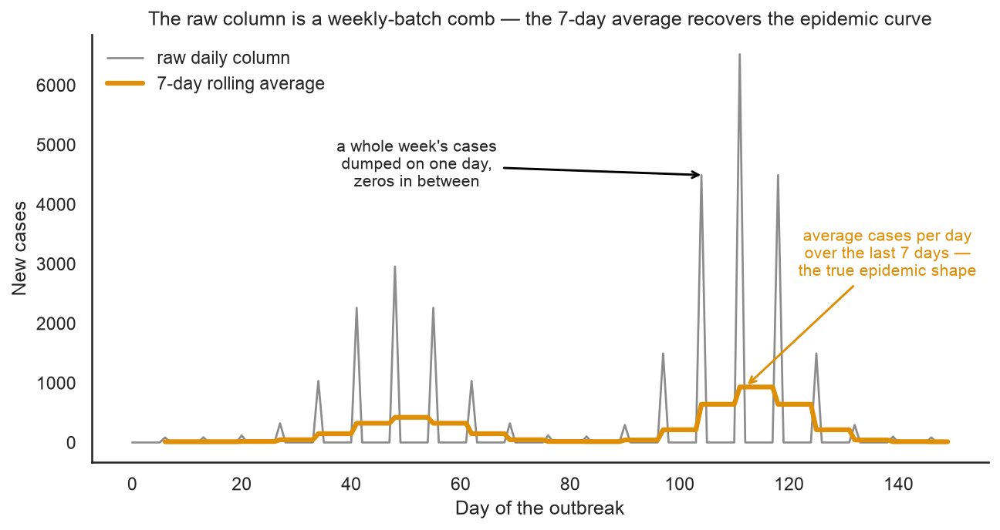
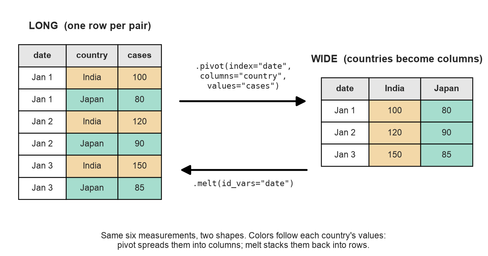
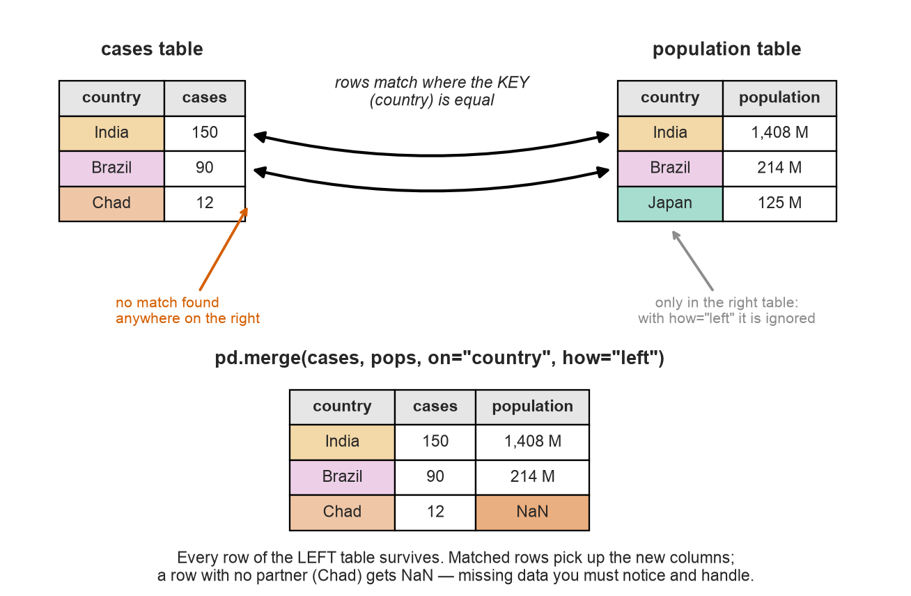

# Module 03 — Data Wrangling with Pandas

*Anatomy of a pandemic: four and a half years of COVID-19, one country at a time.*

**Prerequisites:** [Module 01 — NumPy Foundations](../01-numpy-foundations/README.md), [Module 02 — Pandas Essentials](../02-pandas-essentials/README.md).
**Dataset:** [OWID COVID-19 data](https://huggingface.co/datasets/EPI-Eval/owid-covid) from HuggingFace — 396,995 rows of daily case, death, hospital, and vaccination reports for 237 countries (Our World in Data, January 2020 – August 2024).

## Real analyses are mostly wrangling

Module 02's penguin table was small and already the right shape. Real epidemiology never is. The dataset for this module is roughly a thousand times bigger than the penguins, and before we can ask it a single biological question we'll have to filter it, repair it, reshape it, and combine it with a second table. That work is called **data wrangling**, and working scientists spend far more time on it than on modeling — this module is where you learn the moves.

The data itself is a piece of scientific history: Our World in Data (a research group at the University of Oxford) collected every country's official COVID-19 reports into one table, daily, for the whole pandemic. It powered most of the dashboards you saw on the news. And it has all the scars of real multi-country surveillance: countries that stopped reporting, columns only rich countries filled in, and case counts delivered in weekly batches.

## Dates are data

So far every column has been a number or a piece of text. This dataset introduces a third kind: the **datetime**, pandas' data type for points in time. A datetime column isn't just text that looks like a date — pandas can do calendar math with it: extract the year or month, ask which day of the week a date fell on, keep only rows between two dates. All of that hangs off the `.dt` accessor (`covid["date"].dt.year`, `.dt.day_name()`, ...), and it's how we'll slice the pandemic into years and waves.

## The noise and the signal

Plot the raw `new_cases` column for any country and you get something strange — not a curve but a comb:



The reason is bureaucratic, not biological: in this dataset countries report cases in **weekly batches** — an entire week's total lands on one day, with zeros on the other six. The virus doesn't take six days off; the reporting system does. Every COVID dashboard fixed this the same way, with a **rolling average**: for each day, average the last 7 days of the column. It's the same trick genomics uses to plot GC content along a chromosome — a sliding window that trades pinpoint detail for visible shape. One line of pandas (`.rolling(7).mean()`) turns the comb back into the epidemic curve.

## One table, two shapes

The COVID table is in **long** format: one row per country-and-date pair, stacked 395,000 rows tall. The table you'd naturally build in a spreadsheet is **wide**: one row per date, one column per country. Neither is "correct" — they hold the same measurements — but each has jobs it's better at, and pandas converts between them with a pair of inverse functions, `pivot` and `melt`:



Follow the colors: `pivot` takes each country's stack of values and spreads it out into its own column; `melt` stacks the columns back into rows. Wide is great for math across countries (subtract two columns, smooth all of them at once); long is what `groupby` and seaborn want. Fluency means never being stuck in the wrong shape.

## Merging: when the answer lives in two tables

Here's a question our table *cannot* answer alone: which country was hit hardest? India's waves tower over everyone else's in raw counts — but India has 1.4 billion people. The fair comparison is cases **per million people**, and population isn't a column in the COVID table. It lives in a second, hand-made table, [`datasets/country_populations.csv`](../../datasets/country_populations.csv) (30 major countries; populations are UN 2021 estimates, rounded — which is why the notebook computes "per million" with 2021 denominators even though the pandemic spans five years).

Combining two tables on a shared column is called a **merge** (database people say *join*), and it works like matching gel lanes by their ladder: rows pair up wherever the **key** column — here, the country name — is equal:



Two details matter enormously in practice. A left-table row with no partner gets `NaN` in the new columns (Chad above) — silent missing data you must check for after *every* merge. And the key must match **exactly**: "United States" pairs with "United States", never with "USA". Checking that your keys line up before merging is the wrangler's version of checking primer sequences before a PCR.

## What you'll learn

1. **Load the data** — 396,995 rows from HuggingFace, and the first-look ritual at scale
2. **Filter to countries** — keep `location_level == "national"`, and a new ritual step: checking for duplicate rows
3. **Dates are a real data type** — timezone-aware datetimes, the `.dt` accessor (year, month, day names), and filtering by date range
4. **Missing data at scale** — the Module 02 skills applied to columns that are 90% empty, and what `NaN` means in surveillance data
5. **Raw daily cases** — plot the comb and understand weekly-batch reporting
6. **The 7-day rolling average** — `.rolling(7).mean()`, before and after
7. **Long vs wide** — `pivot` a date × country table, smooth all four countries in one line, `melt` it back
8. **Merging tables** — `pd.merge` on country name, join types, and cases per million
9. **The per-million reveal** — the same four epidemic curves, before and after dividing by population
10. **Group-by at scale** — total deaths by continent, built from a groupby, a merge, and another groupby

## How to work through it

```bash
source ../../.venv/bin/activate
jupyter lab notebook.ipynb
```

Run each cell in order, predicting outputs first. Then do [exercises.md](exercises.md).

## The one idea to remember

> **Wrangling is 90% of the work, and it's four moves: filter, reshape, merge, aggregate.**
> India's raw case counts dwarf Germany's; merge in one small population table and Germany's per-person peak turns out to be ten times higher. The analysis didn't need a model — it needed the right table.
