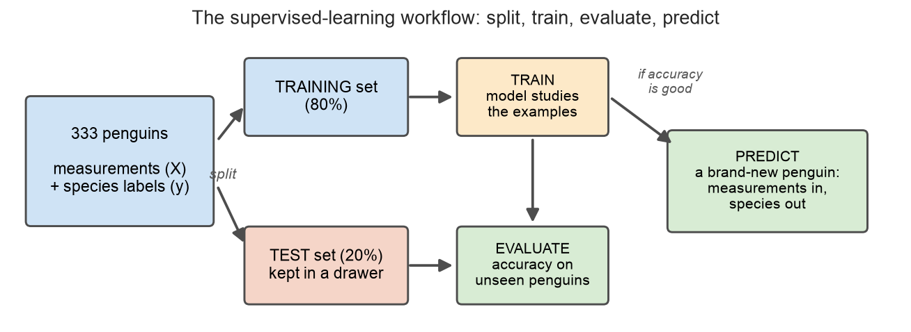
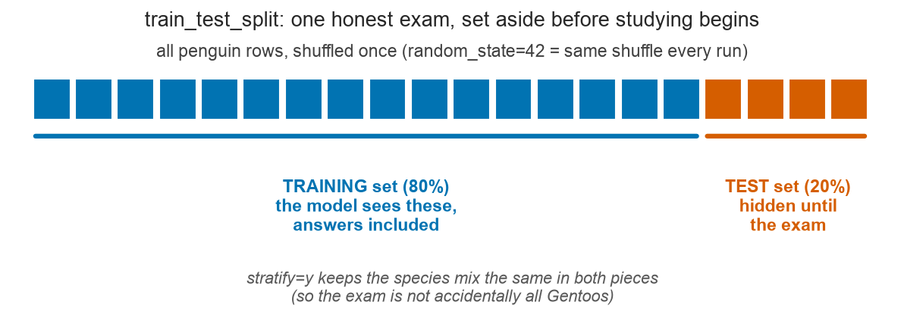
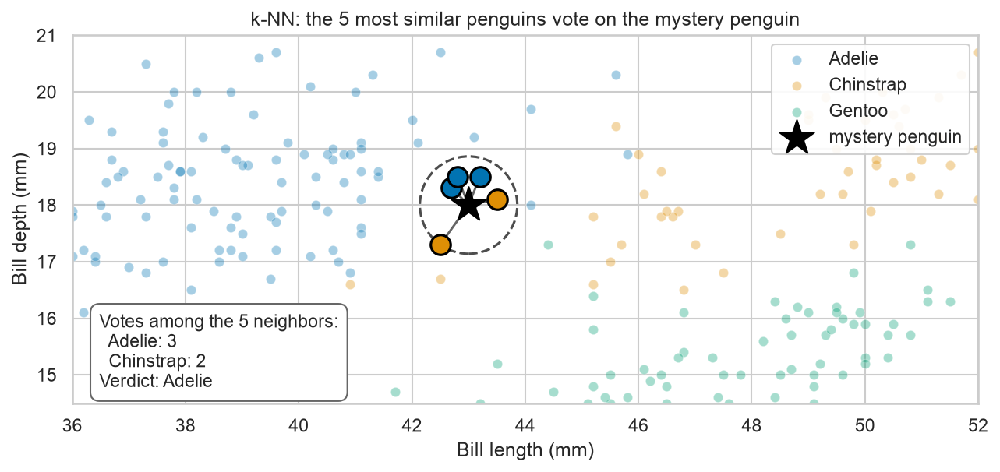
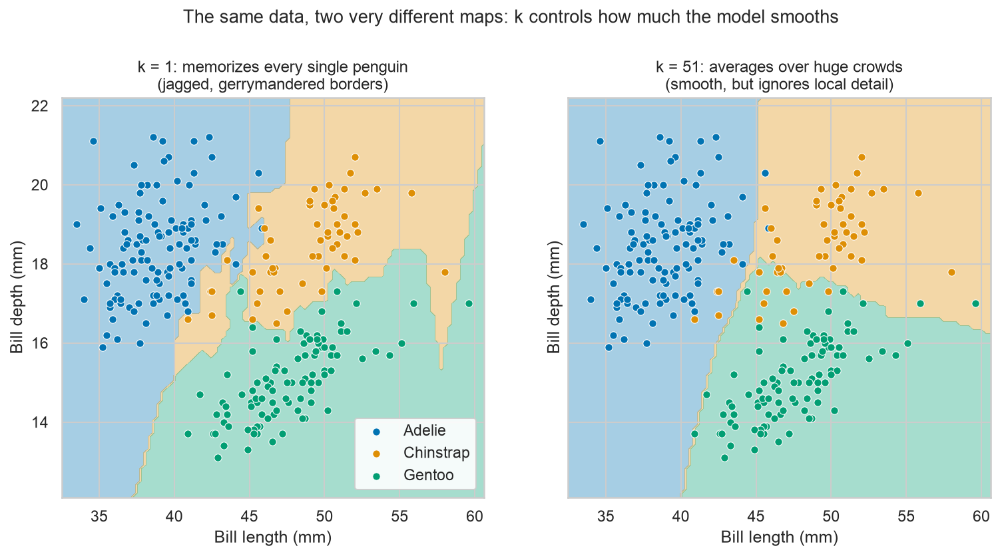

# Module 04 — Your First Machine-Learning Model

*Teaching a computer to identify penguins.*

**Prerequisites:** [Module 02 — Pandas Essentials](../02-pandas-essentials/README.md) — this module reuses its penguin dataset, its cleaning step, and its plotting habits. [Module 03 — Data Wrangling with Pandas](../03-pandas-data-wrangling/README.md) is good background but not required here.
**Dataset:** [Palmer Penguins](https://huggingface.co/datasets/SIH/palmer-penguins) from HuggingFace — the same 344 Antarctic penguins from Module 02, now with a job to do: teach a computer to tell the three species apart.

## What "learning from data" actually means

A field biologist at Palmer Station can glance at a penguin and say "Chinstrap" without thinking. Nobody handed her a rulebook — she learned the skill by seeing hundreds of penguins *whose species she was told*. Examples first, pattern second.

**Machine learning** is the same trick performed by a program: instead of a human writing down rules ("if the bill is longer than 45 mm and deeper than 17 mm, then..."), we show the computer many measured examples **together with the correct answers**, and it works out the pattern on its own. When the examples come with answers attached, it's called **supervised learning** — the answers supervise the learning, like the senior biologist standing behind you saying "yes, that one's a Gentoo."



This diagram is the whole module in one picture. Every supervised-learning project — from penguins to tumor diagnosis to protein structure — follows these same arrows: split the labeled data, train on one part, grade on the held-out part, and only then trust the model with new cases.

## Features and labels: X and y

Machine learning has two starring variables, and the names never change:

- **Features** (called `X`) — the measurements we base the guess on: bill length, bill depth, flipper length, body mass. One row per penguin, one column per measurement. In taxonomy terms, these are the *characters* of a specimen.
- **Label** (called `y`) — the answer column: the species, as identified by the field biologists. One entry per penguin.

The job of a **model** — the thing that does the learning — is to absorb the pattern connecting `X` to `y`, so that later it can take a new penguin's `X` and produce a `y` of its own. A model that answers "which category?" (Adélie / Chinstrap / Gentoo) is called a **classifier**.

## The exam rule: hold out a test set

Here's the trap that separates real machine learning from wishful thinking. Suppose a student gets the exam questions *and the answer key* the night before, memorizes both, and scores 100%. Did they learn any biology? You can't tell — the score is meaningless, because they were graded on questions they'd already seen.

A model can cheat the same way: score it on penguins it trained on and it can look brilliant while having merely memorized. The fix is simple and non-negotiable — **before any training happens, lock part of the data in a drawer**:



- The **training set** (80% of the penguins) is the textbook: the model studies these rows, answers included.
- The **test set** (20%) is the final exam: penguins the model has never seen. Accuracy on *these* is the only score that counts.

The one line of code that does this, `train_test_split`, has two options worth understanding up front. `random_state=42` fixes the shuffle so everyone who runs the notebook gets the *same* split — reproducibility, exactly like recording your randomization seed in a methods section. `stratify=y` keeps the species proportions the same in both pieces — the same reason ecologists use stratified sampling: a random cut could, by bad luck, put nearly all the Chinstraps in the exam.

## The most intuitive classifier: k-nearest neighbors

Our first model is the one you already use. When you BLAST an unknown DNA sequence, you don't apply a grand theory of genomes — you find the *closest matching sequences* in a database and read their annotations. **k-nearest neighbors (k-NN)** does exactly this with measurements: to classify a mystery penguin, find the **k** most similar penguins in the training set (similar = closest when plotted), and let them **vote**.



Here a mystery penguin (the star) sits in the contested border zone between the Adélie and Chinstrap clouds. Its 5 nearest training penguins are 3 Adélies and 2 Chinstraps — so the verdict is Adélie, 3 votes to 2. That's the entire algorithm. "Training" a k-NN model is just filing away the reference collection, like a museum keeping labeled specimens; all the work happens at identification time.

## Decision boundaries: the model as a map

Because k-NN can classify *any* point, not just real penguins, we can ask it to classify every point on the plot and paint each one by its answer. The result is a **decision boundary** map: colored territories, one per species, whose borders show exactly where the model changes its mind.



The choice of **k** — how many neighbors get a vote — changes the map dramatically:

- **k = 1**: a single nearest neighbor decides everything. Every quirky individual penguin gets its own little territory, and the borders gerrymander around one-off oddballs. The model has **memorized** the training data — noise included. This is called **overfitting**, and it's the memorizing student again: perfect on the training set, shakier on the exam.
- **k = 51**: fifty-one voters smooth away all local detail. The borders are clean, but genuinely informative pockets get steamrolled by the majority. Averaging *too* much is called **underfitting** — like a dichotomous key with only one question in it.
- Good values of k sit in between (we'll use k = 5): enough voters to outvote the oddballs, few enough to respect real local structure.

## Distance needs a fair ruler

k-NN's whole notion of "similar" is distance on the plot — and that quietly assumes every axis uses comparable units. Combine flipper length (millimeters, values ~172–231) with body mass (grams, values ~2700–6300) and the mass axis is thousands of units wide while the flipper axis spans about sixty. Distance becomes essentially *mass alone*; the flipper might as well not exist. It's like comparing gene-expression profiles without normalizing — the highest-expressed gene swamps everything else.

The fix is **standardization**: convert each feature to "how many standard deviations above or below its own average" (a z-score — the same trick behind clinical reference ranges and normalized expression values). After scaling, every feature spans a comparable range and each one gets a fair vote in the distance. scikit-learn packages this as `StandardScaler`, and in the notebook you'll watch accuracy jump the moment we use it.

## What you'll learn

1. **Load and clean** — the same penguins, the same cleaning ritual as Module 02
2. **Features X and label y** — restating a DataFrame as a learning problem
3. **The train/test split** — `train_test_split`, and what `random_state` and `stratify` do
4. **Training k-NN** — `KNeighborsClassifier` with k = 5 on two bill measurements
5. **Accuracy** — the score on the test set, and why the training-set score flatters
6. **The decision boundary** — painting the model's map with `DecisionBoundaryDisplay`
7. **Varying k** — 1 vs 5 vs 51: watching overfitting and underfitting happen
8. **Feature scaling** — mm vs g breaks distance; `StandardScaler` repairs it
9. **The full model** — all four measurements, plus a brand-new penguin identified with vote counts (`predict_proba`)

## How to work through it

```bash
source ../../.venv/bin/activate
jupyter lab notebook.ipynb
```

Run each cell in order, predicting outputs first. Then do [exercises.md](exercises.md).

## The one idea to remember

> **A model is only as good as its answers on data it has never seen.**
> Training accuracy measures memory; test accuracy measures learning. Split first, train second, and let only the held-out penguins grade the model.
