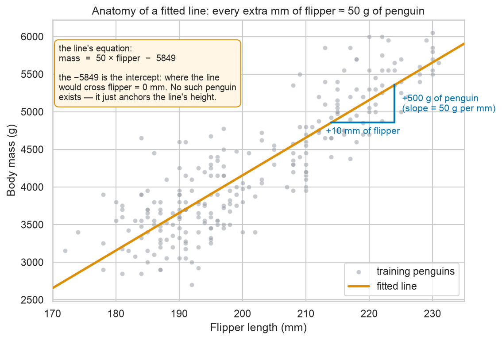
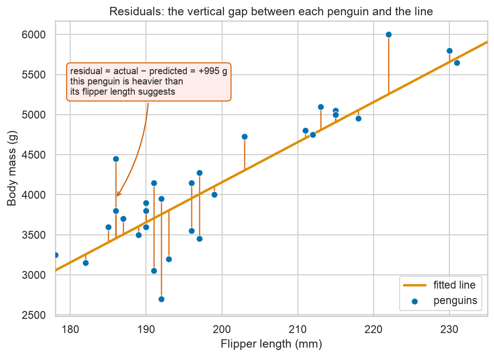
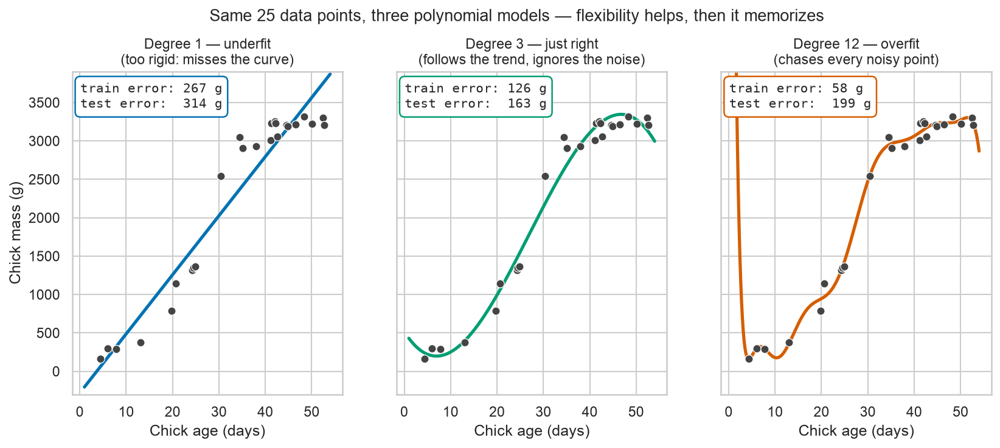

# Module 05 — Regression: predicting numbers

*Can you weigh a penguin with a ruler?*

**Prerequisites:** [Module 04 — Your first machine-learning model](../04-first-machine-learning/README.md) (features, labels, and the train/test split).
**Dataset:** [Palmer Penguins](https://huggingface.co/datasets/SIH/palmer-penguins) from HuggingFace — the same 344 Antarctic penguins from Module 02, measured by field biologists at Palmer Station (2007–2009).

## From "which kind?" to "how much?"

Module 04 answered a **classification** question: *which species is this penguin?* The answer was a category — one of three names.

This module answers a **regression** question: *how much does this penguin weigh?* The answer is a **number**, and any number is fair game — 3,741 g is a perfectly good prediction even though no penguin in our data weighs exactly that. That's the whole difference: classification picks from a menu, regression reads off a dial.

Why would a biologist want this? Because weighing wild animals is hard. A penguin won't sit on a scale; a whale *can't*. So field biologists constantly estimate mass from measurements that are easy to get — a flipper in a photo, a footprint, a bone. The study of how body measurements scale with each other is called **allometry**, and it's a real, respected corner of biology. Fitting a line through measurement data is exactly what an allometry paper does — we're just going to let scikit-learn hold the ruler.

## The line, and how to read it

Our first model uses one measurement (flipper length) to predict one number (body mass). The model is nothing more than a straight line through the scatter plot — but a line you can *read*, the way you read a dosage chart:



Two numbers define the line, and both mean something biological:

- **Slope** — the exchange rate between the two measurements. Here it's about **50 grams of penguin per millimeter of flipper**: compare two penguins whose flippers differ by 10 mm, and the model expects their masses to differ by about 500 g.
- **Intercept** — where the line would cross flipper = 0 mm. A zero-flippered penguin doesn't exist, so don't read biology into it; it's just the anchor that sets the line's height. (Slopes usually mean something; intercepts often don't.)

How does scikit-learn choose *this* line out of all possible lines? It picks the one whose total (squared) vertical error against the training penguins is smallest — the "least squares" line. Which brings us to those vertical errors.

## Residuals: what the line gets wrong

No penguin sits exactly on the line. The vertical gap between a real penguin and the line's prediction for it is called a **residual** (= actual − predicted; what's "left over" after the model has said its piece):



A positive residual is a penguin heavier than its flipper suggests (maybe it just ate); a negative one is lighter. Residuals are where a scientist should look first, because their *pattern* is diagnostic:

- A shapeless cloud of residuals, evenly above and below zero → the line has captured the trend, and what's left is noise.
- **Structure** in the residuals — a curve, a fan, or one group of penguins sitting consistently above the line — means the model is systematically missing something, and often points straight at a lurking variable (species, say, or sex). It's the same instinct as looking at a gel that ran funny: the artifact tells you what to fix.

## Putting a number on "how wrong"

Eyeballing residuals is good; summarizing them in one number lets us compare models. Three standard scores, all computed on the **test set** (penguins the model never saw — the honesty rule from Module 04):

- **MAE (mean absolute error)** — the average size of the mistakes, in real units. "Off by about 290 g on a typical penguin" — instantly meaningful.
- **RMSE (root mean squared error)** — like MAE, but big mistakes are punished extra hard before averaging. Always ≥ MAE; a large gap between the two means a few penguins are being missed badly.
- **R²** — the fraction of the mass variation the model explains, on a scale where 0 means "no better than always guessing the average penguin" and 1 means "perfect". Flipper length alone scores about 0.76: one photo-friendly measurement explains three-quarters of why penguins differ in mass.

## More measurements, better estimates — carefully

A field biologist wouldn't stop at one measurement, and neither will we. **Multiple regression** feeds several features to the same `LinearRegression` — flipper length, bill length, bill depth, and sex — and the model finds the best slope *for each one*. Prediction improves (test MAE drops by a real, if modest, amount).

But the slopes now demand caution. In the notebook you'll see bill depth get a *negative* slope — "deeper bill, lighter penguin"?! That's biological nonsense, and the resolution is a classic confounding story: Gentoos happen to be both the heaviest species *and* the shallow-billed one, so within this mixed-species dataset, bill depth acts as a (backwards) species marker. Each slope means "the effect of this feature *with the others held fixed, in this particular dataset*" — not "the effect of this feature in nature." Correlation-based models make excellent predictors and treacherous storytellers.

## Your first overfit, seen with your own eyes

A straight line is a rigid model. **Polynomial features** let a linear model bend: give it flipper, flipper², flipper³, … and the "line" becomes a curve, as flexible as you like. Flexibility sounds like a free upgrade. It isn't — and this triptych is the most important picture in the course so far:



Same 25 data points in every panel. The degree-1 line is too rigid and misses the curve (**underfitting** — high error on train *and* test). Degree 3 follows the trend and shrugs off the noise (best test error). Degree 12 threads through nearly every training point — the *lowest training error of the three* — and yet its test error is the mark of failure: it has memorized the noise, like a student who memorized last year's answer key, typos included. That is **overfitting**, and in the notebook you will reproduce it on real penguins and watch the wiggly curve win on training data and lose on test data.

## What you'll learn

1. **Load and re-clean the penguins** — the Module 02 ritual, in three lines
2. **The question, as a picture** — scatter flipper length vs body mass
3. **Split first, always** — a quick `train_test_split` recap
4. **Fit a line and read it like a biologist** — `LinearRegression`, slope and intercept in penguin units, the line drawn over the data
5. **Residuals** — vertical errors, the residual plot, and what structure in it means
6. **Scoring the model** — MAE, RMSE, and R² on the test set
7. **Multiple regression** — adding bill measurements and sex, and reading coefficients with caution
8. **The overfitting demo** — polynomial degree 1 vs 3 vs 12 on 25 penguins: train error falls, test error explodes

## How to work through it

```bash
source ../../.venv/bin/activate
jupyter lab notebook.ipynb
```

Run each cell in order, predicting outputs first. Then do [exercises.md](exercises.md).

## The one idea to remember

> **A model that fits the training data perfectly has often just memorized it.**
> Training error only ever flatters a flexible model; the test set is where memorization gets caught. Module 07 turns this warning into a full workflow for not fooling yourself.
