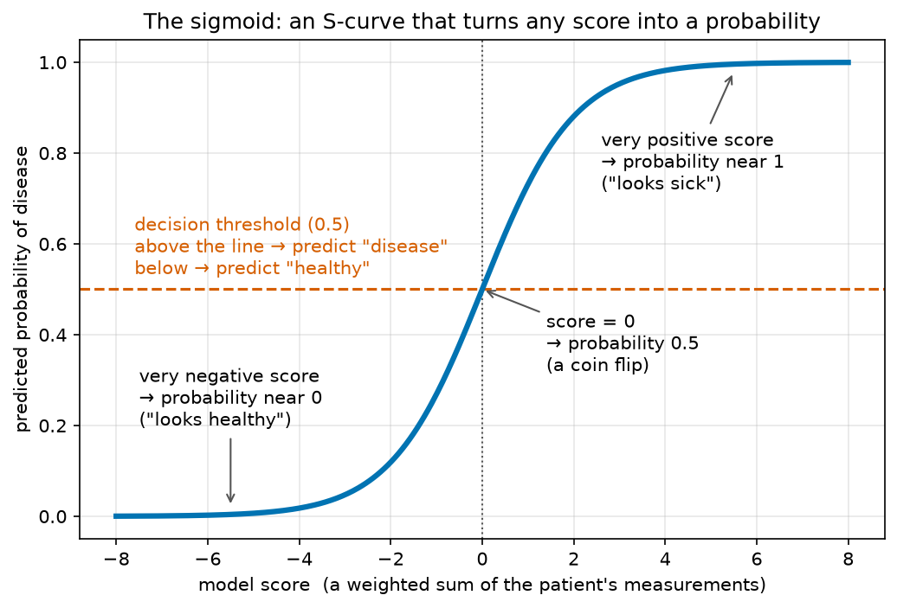
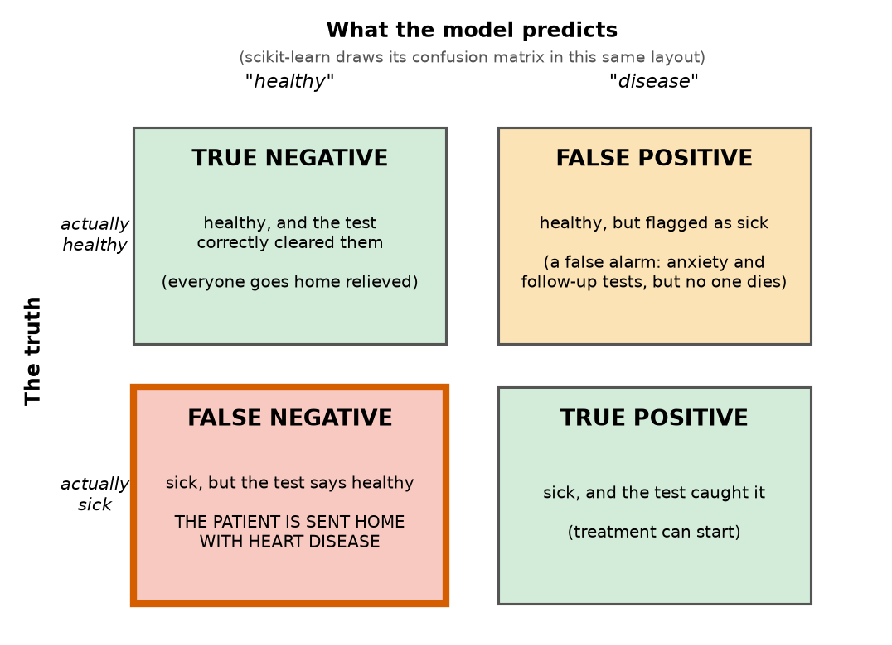
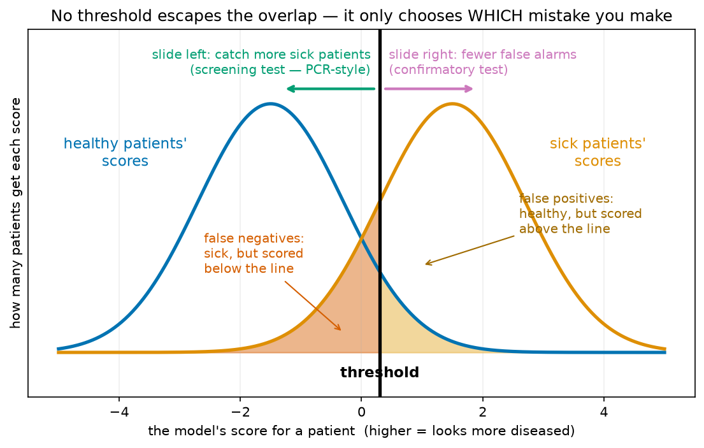
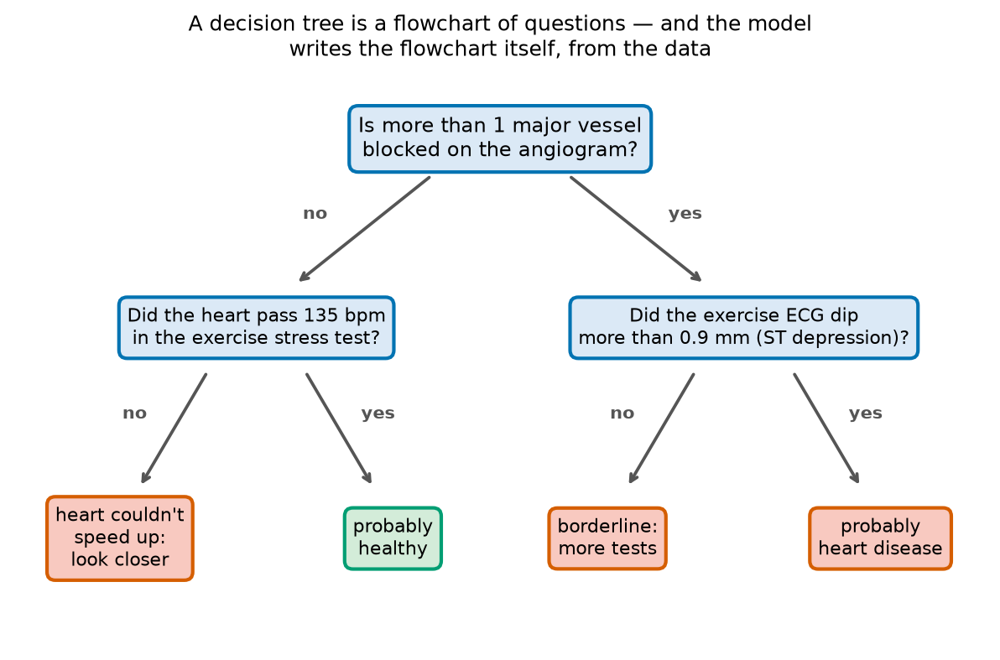

# Module 06 — Classification in Depth: When Accuracy Lies

*A heart-disease test can be 88% accurate and still send four out of ten sick patients home. This module is about noticing.*

**Prerequisites:** [Module 04 — Your First Machine-Learning Model](../04-first-machine-learning/README.md) (features/labels, `train_test_split`, accuracy) and [Module 05 — Regression](../05-regression-predicting-numbers/README.md) (fitted lines, overfitting).
**Dataset:** [Heart Disease (Cleveland)](https://huggingface.co/datasets/buio/heart-disease) from HuggingFace — 303 real patients examined at the Cleveland Clinic in the late 1980s: age, blood pressure, cholesterol, stress-test ECG results, and whether they turned out to have coronary artery disease.

## 303 patients, one question

In the late 1980s, cardiologist Robert Detrano and colleagues at the Cleveland Clinic recorded thirteen measurements for each of 303 patients suspected of heart disease — everything from resting blood pressure to how the heart behaved on a treadmill — and then did an angiogram (dye injected into the coronary arteries, photographed under X-ray) to find out the truth. This dataset became one of the most-studied benchmarks in machine learning, because it poses the question every diagnostic test poses: **from the cheap measurements, can we predict the expensive truth?**

Here is the trap this module is named after. In our data only about 27% of the patients have heart disease. A "model" that just says *"healthy!"* to every single patient — never looks at a number, never thinks — is right 73% of the time. Seventy-three percent accuracy, zero medical value: it sends home *every* sick patient. **Accuracy** (the fraction of predictions that are correct) is one number trying to summarize two very different kinds of mistake, and in medicine those mistakes are not interchangeable. A false alarm costs anxiety and a follow-up test. A missed case can cost a life.

You already know this from biology lab. Nobody describes a PCR test with one number — they quote its *sensitivity* and its *specificity*, precisely because "how often does it catch real infections?" and "how often does it wrongly flag healthy people?" are separate questions. This module teaches the machine-learning version of that vocabulary.

## From a line to a probability: logistic regression

Module 05's linear regression predicted a *number* (grams of penguin). Here we want a *yes/no* — but a bare yes/no throws information away. A doctor doesn't think "disease: yes"; she thinks "this patient is maybe 80% likely to have disease — order the angiogram." We want the model to output a **probability**.

**Logistic regression** does exactly that, in two steps. First it computes a score the same way linear regression does: a weighted sum of the patient's measurements (age counts for so much, max heart rate for so much, and so on). That score can be any number from minus infinity to plus infinity — not a probability. So, second, it feeds the score through the **sigmoid**, an S-shaped squashing function:



However extreme the score, the sigmoid maps it into the range 0 to 1: hugely negative scores land near 0 ("almost certainly healthy"), hugely positive ones near 1 ("almost certainly diseased"), and a score of 0 lands exactly at 0.5 — a coin flip. If the S-shape looks familiar, it should: it's the same shape as a **dose–response curve** in pharmacology or an enzyme's saturation curve — flat, then steep through the interesting middle, then flat again. Despite the name, logistic *regression* is a classifier; the "regression" part is the weighted-sum score hiding inside.

To turn the probability into a decision, we pick a cutoff — by default 0.5 — called the **decision threshold**. Remember that word; the second half of this module is about refusing to accept the default.

## Four ways to be right or wrong: the confusion matrix

For a yes/no test there are exactly four possible outcomes, and the 2×2 table that counts them is called the **confusion matrix**:



The two green cells are the model being right. The two others are *different* mistakes: a **false positive** is a false alarm (healthy patient flagged — stressful, wasteful, survivable), while a **false negative** is the nightmare cell — a sick patient told they're fine and sent home. Accuracy adds up the greens and divides by the total, which means it *cannot see the difference* between the two error cells. Two models can have identical accuracy while one of them is dramatically more dangerous. In the notebook you'll meet a real example: our logistic regression scores a healthy-sounding 88% while quietly missing 8 of the 21 sick patients in the test set.

## Sensitivity and specificity — words you already know

From the four cells come the two numbers every diagnostic test is judged by, the same ones printed on the box of a COVID test:

- **Sensitivity** — *of the people who are actually sick, what fraction does the test catch?* (true positives ÷ all actually-sick). PCR tests are prized for sensitivity near 99%: infections almost never slip past.
- **Specificity** — *of the people who are actually healthy, what fraction does the test correctly clear?* (true negatives ÷ all actually-healthy). High specificity means few false alarms.

Machine learning, having grown up outside the clinic, uses its own names for closely related ideas. **Recall** is *exactly* sensitivity — same formula, different community. **Precision** asks a subtly different question: *of the patients the model flagged, how many were really sick?* — that is, how trustworthy is a positive result. You'll compute all of them by hand from the matrix once, so the names attach to cells rather than to formulas memorized in the dark.

## The threshold is a dial, not a law of nature

Why do sensitivity and specificity fight each other? Because the sick and the healthy *overlap*. Some genuinely sick patients have unremarkable numbers; some healthy patients look alarming. Plot the model's scores for both groups and you get two overlapping distributions — and the threshold is just a line drawn through them:



Slide the line left and you catch more of the sick (sensitivity up) at the cost of more false alarms (specificity down). Slide it right and the reverse. **No position eliminates both shaded regions** — the threshold only chooses which mistake you'd rather make. That choice is medical, not mathematical: a *screening* test (first-pass, catch everything, like PCR during an outbreak) wants the line pushed left; a *confirmatory* test (before risky surgery) wants it pushed right. In the notebook you'll move our model's threshold from 0.5 down to 0.3 and up to 0.7 and watch the confusion matrix reshape itself — at 0.3, five of those eight missed patients get caught.

Trying every threshold at once and plotting sensitivity against false alarms gives the **ROC curve**, with the **AUC** (area under it) as a single honest summary of the whole dial: 1.0 is a perfect test, 0.5 is a coin flip. Our patients' data lands around 0.94 — genuinely informative, genuinely imperfect.

## A flowchart that grows itself: the decision tree

Doctors don't compute weighted sums in their heads — they follow flowcharts: *if this, check that.* A **decision tree** is a model with exactly that shape, except the computer designs the flowchart itself by repeatedly finding the question that best splits sick from healthy:



Read it aloud, top to bottom, like a clinician: *"Is more than one major vessel blocked on the angiogram? If not — did the heart get past 135 beats per minute on the treadmill? A heart that can speed up when asked is probably healthy; one that can't deserves a closer look. If vessels **are** blocked — did the ECG trace dip during exercise (ST depression)? A dip on top of blockage: probably disease."* This is a real chain of reasoning, learned from data, and it's essentially the top of the actual tree the notebook will grow with `DecisionTreeClassifier` and draw with `plot_tree`. That readability is the tree's superpower — and its weakness is Module 05's old enemy: let a tree grow deep enough and it will happily memorize every patient (100% on training data) while doing *worse* on new ones.

## A parliament of trees: the random forest

The fix for one overconfident tree is democracy. A **random forest** grows hundreds of trees, each trained on a slightly different random sample of the patients and allowed to consider only a random subset of the measurements at each question — then lets them **vote**. It's a panel of specialists, each with partial information and personal quirks, whose individual errors tend to cancel out. Wisdom-of-the-crowd, but for flowcharts.

Forests give up the single readable flowchart, but offer a consolation prize: **feature importance**, a score for how much each measurement contributed to the forest's decisions across all its trees. Which of the thirteen measurements did the forest find most diagnostic? In our data: the exercise ECG dip, the maximum heart rate, and the number of blocked vessels — the treadmill stress test earns its keep. The notebook ends with the real question a clinic would face: which of the three models would *you* deploy, and — just as important — at which threshold?

## What you'll learn

1. **Load & decode** — fetch the 303 patients, rename cryptic 1980s column names (`trestbps` → `resting_bp`), and clean two data-entry typos
2. **Meet the patients** — age/sex/disease distributions, and the 73% accuracy trap
3. **Logistic regression** — the sigmoid in action: predicted probability vs. max heart rate
4. **The confusion matrix** — `ConfusionMatrixDisplay`, four cells read in medical language
5. **Sensitivity & specificity by hand** — then their ML names, recall and precision
6. **Moving the threshold** — 0.3 vs. 0.5 vs. 0.7, screening vs. confirmatory
7. **ROC curve & AUC** — the whole trade-off in one picture
8. **A decision tree you can read** — grow it, draw it, catch it overfitting
9. **Random forest** — many trees voting, plus the feature-importance bar chart
10. **The deployment question** — compare all three models like a hospital would

## How to work through it

```bash
source ../../.venv/bin/activate
jupyter lab notebook.ipynb
```

Run each cell in order, predicting outputs first. Then do [exercises.md](exercises.md).

## The one idea to remember

> **Accuracy is one number; a diagnosis has four outcomes.**
> Never judge a classifier without asking *which* mistakes it makes — and remember the threshold is a dial you are allowed, and obligated, to turn.
