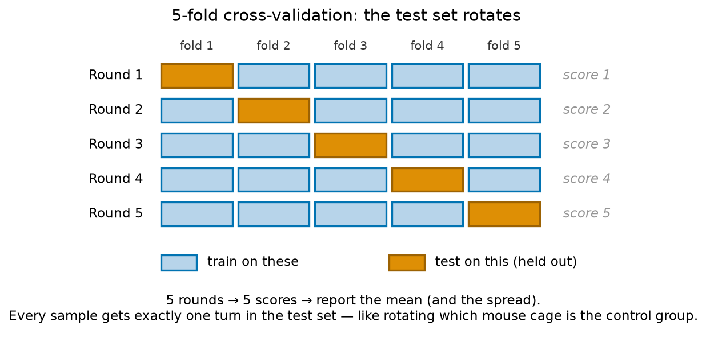
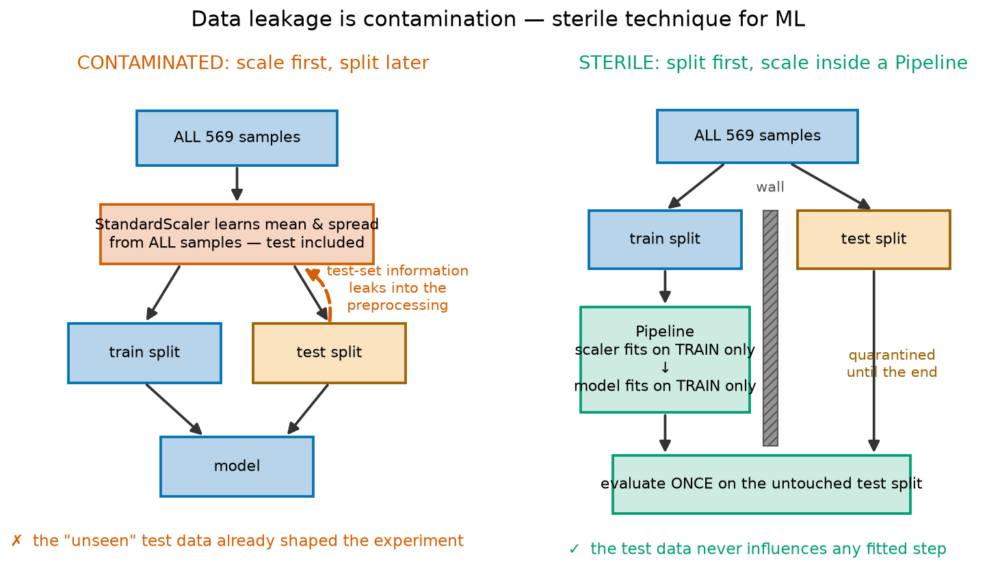
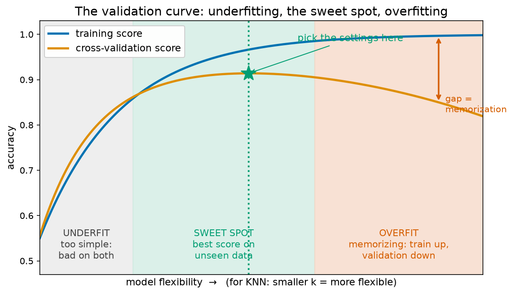

# Module 07 — The Honest-Scientist Workflow

*Tumor diagnosis, done rigorously — the ML equivalent of sterile technique.*

**Prerequisites:** [Module 06 — Classification: When Accuracy Lies](../06-classification-when-accuracy-lies/README.md) (and everything before it — this module assumes you can already train a classifier and read its accuracy).
**Dataset:** [Breast Cancer Wisconsin](https://huggingface.co/datasets/scikit-learn/breast-cancer-wisconsin) from HuggingFace — 569 breast-tumor samples, each described by 30 measurements of cell nuclei taken from microscope images, labeled malignant or benign by pathologists.

## Not fooling yourself

You already know the hard part of science isn't getting *a* result — it's making sure the result is *real*. That's why wet labs have sterile technique, negative controls, blinded scoring, and technical replicates. None of those make your bacteria grow better; they exist so that **you can't accidentally fool yourself**.

Machine learning needs the exact same discipline, and this module is where you learn it. The models are ones you've already met (mostly k-nearest-neighbors). What's new is the *protocol*: how to split, measure, preprocess, and tune so that the accuracy number you report at the end is one you'd be willing to defend in a lab meeting.

The stakes are real here. In the early 1990s, Dr. William Wolberg at the University of Wisconsin was diagnosing breast tumors from **fine-needle aspirates** — a thin needle draws a few cells from a breast mass, they're stained on a slide, and a pathologist examines the nuclei under a microscope. Malignant nuclei tend to be larger, more irregular, and more variable than benign ones. Wolberg's team digitized the slide images and computed 30 numbers per sample (things like mean nucleus radius, texture, and concavity), then asked: can a computer diagnose from the numbers alone? Every diagnosis in the dataset was later confirmed, so the labels are trustworthy. A model that's wrong here sends a patient home with cancer — "I think my accuracy is about 95%?" is not good enough.

## The problem: shuffle luck

`train_test_split` shuffles the rows randomly before splitting. Change the random seed and you get a *different* shuffle — different patients in the test set — and a **different accuracy for the exact same model**. In the notebook you'll run the same model on ten different shuffles and watch accuracy wander between roughly 89% and 94%. Which number would you publish?

A biologist recognizes this instantly: it's the single-measurement problem. You'd never report a qPCR result from one well. You'd run replicates and report the mean and the spread.

## The fix: cross-validation — everyone takes a turn as the test set



**k-fold cross-validation** is replicates for model evaluation. Cut the data into k equal chunks ("folds"). Train on k−1 of them, test on the one held out — then rotate, so every fold gets exactly one turn as the test set. You get k scores instead of one, and you report the mean and the spread. One extra wrinkle: we use the **stratified** version, which keeps the malignant/benign ratio the same in every fold — the same reason you'd balance treatment and control groups when assigning mice to cages.

## Scaling, and the contamination trap

KNN works by measuring distances between samples. But our 30 columns live on wildly different scales: `area_mean` is in the hundreds while `smoothness_mean` is around 0.1. Unscaled, the distance is effectively *only* the area — like scoring cell similarity using diameter-in-nanometers plus pH and pretending both mattered. **StandardScaler** fixes this by putting every column in units of "standard deviations from the mean" (the same z-score idea as always). On this dataset, scaling alone eliminates almost half of KNN's mistakes.

But scaling introduces the subtlest trap in this whole course. The scaler *learns* something from data — each column's mean and spread. If you scale the **whole dataset first** and split afterwards, those means and spreads were computed partly *from the test samples*. Information from your "unseen" data has seeped into the preprocessing. That is **data leakage**, and it is exactly contamination: the test set is your sealed, blinded sample, and you just pipetted a little of it into every tube on the bench.



The insidious part: on this dataset the leaky number and the honest number look almost identical (you'll see ~96.7% vs ~96.3%). Contaminated cultures don't always look contaminated either — that's *why* sterile technique is a habit, not a judgment call. On other datasets leakage inflates scores dramatically, and you have no way of knowing in advance which case you're in.

The fix is scikit-learn's **`Pipeline`**: bundle the scaler and the model into one object. Cross-validation then re-fits the scaler *inside* each training fold, and the held-out fold stays genuinely unseen. Once your preprocessing lives in a Pipeline, this whole class of mistake becomes impossible — sterile technique built into the glassware.

## Tuning honestly, and seeing overfitting as a picture

How many neighbors should KNN use? Rather than guessing, **`GridSearchCV`** tries every value you list, evaluates each one with cross-validation, and hands you the winner — an honest, replicated screen instead of cherry-picking the value that happened to look best on one lucky split.

Sweeping a whole range of k values and plotting training score against cross-validation score gives the **validation curve**, one of the most useful pictures in machine learning:



On the left, the model is too rigid to capture the biology (**underfitting** — both scores poor). On the right, it flexibly memorizes its training samples, so the training score soars while the score on unseen data slides (**overfitting** — the gap between the curves is memorization). You want the sweet spot: the peak of the *orange* curve, never the blue one. For KNN, *small* k is the flexible end — with k=1 the model memorizes every training tumor perfectly and you'll watch its training accuracy hit a meaningless 100%.

## The final protocol

One last subtlety: after trying ten values of k and keeping the best cross-validation score, even that number is a little optimistic — you *selected* it for being the maximum. So the full honest workflow, which the notebook walks through end-to-end, is:

1. **Lock away a test set first** and don't touch it — your sealed blinded sample.
2. On the training portion only, tune with **GridSearchCV** over a **Pipeline**.
3. Unseal the test set **once**, at the very end, for the number you report.

## What you'll learn

1. **Load the data — and fire the ID column** — why a sample ID must never be a feature, plus mapping the diagnosis to 0/1
2. **First look at the tumors** — the first-look ritual, class balance, and what separates malignant from benign nuclei
3. **Shuffle luck** — ten random splits, ten different accuracies for the same model
4. **Cross-validation** — `cross_val_score` and `StratifiedKFold`: replicates for models
5. **Scaling** — why distance-based models need `StandardScaler`, and how much it helps
6. **Data leakage and the Pipeline** — the contamination sin, and the glassware that makes it impossible
7. **GridSearchCV** — screening hyperparameter values honestly; `.best_params_` and `.best_score_`
8. **The validation curve** — underfitting and overfitting on one plot, with the sweet spot
9. **The final protocol** — hold out, tune inside, evaluate once; the number you'd defend in lab meeting

## How to work through it

```bash
source ../../.venv/bin/activate
jupyter lab notebook.ipynb
```

Run each cell in order, predicting outputs first. Then do [exercises.md](exercises.md).

## The one idea to remember

> **The test set is your sealed, blinded sample — anything that learns from data must learn from training data only, and you open the test set exactly once, at the end.**
> Cross-validation gives you replicates, the Pipeline gives you sterile technique, and together they make the final number one you can't have fooled yourself into.
