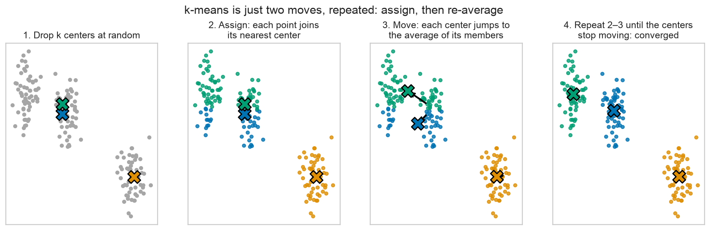
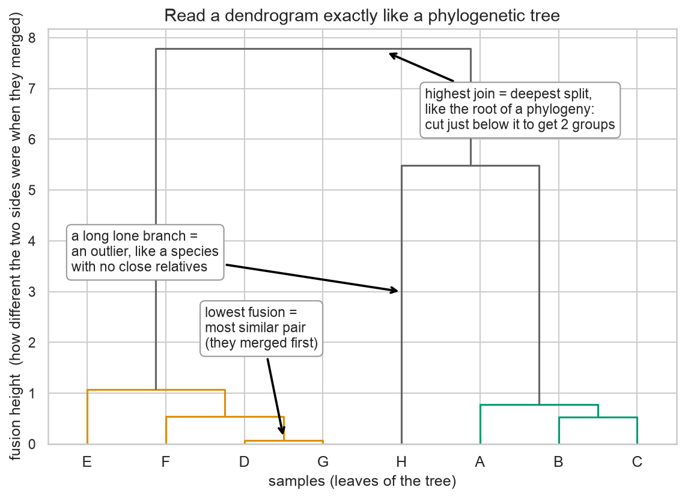
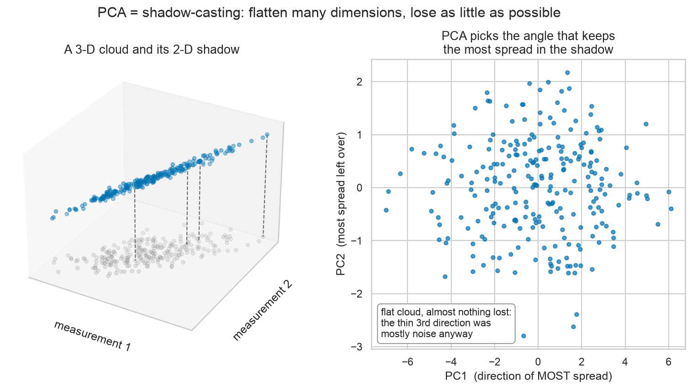

# Module 08 — Unsupervised Learning: Patterns Without Answers

*Hide the diagnosis column. Would the data have discovered tumor types on its own?*

**Prerequisites:** [Module 07 — The Honest-Scientist Workflow](../07-honest-scientist-workflow/README.md) (you'll reuse `StandardScaler` and this same dataset). [Module 02 — Pandas Essentials](../02-pandas-essentials/README.md) supplies `pd.crosstab` for the finale.
**Dataset:** [Breast Cancer Wisconsin](https://huggingface.co/datasets/scikit-learn/breast-cancer-wisconsin) from HuggingFace — 569 breast tumors, each described by 30 microscope measurements of cell nuclei, plus a pathologist's diagnosis (malignant/benign) that we will *seal in an envelope and not look at until the very end*.

## Learning without a teacher

Every model you've trained so far was **supervised**: we handed it the measurements *and* the right answers, and it learned to connect them. This module removes the answers. **Unsupervised learning** means the algorithm sees only the measurements and must find structure — groups, gradients, patterns — entirely on its own.

This isn't a party trick; it's one of the most-used tools in modern biology, because most of the time *nobody knows the answers yet*:

- **Single-cell RNA-seq:** sequence 10,000 individual cells and you get 10,000 expression profiles with no labels. Which cell types are present? Clustering answers that — it's literally step one of every scRNA-seq pipeline.
- **Tumor subtypes:** breast cancer's famous molecular subtypes (luminal A, luminal B, HER2-enriched, basal-like) were not decreed by a committee. They were *discovered* around 2000 by clustering gene-expression profiles of tumors and noticing the samples fell into natural families.

So we'll play that game honestly: load 569 tumors, immediately set the diagnosis aside unseen, and ask whether the measurements alone reveal tumor types. At the end, we open the envelope and compare our label-free groups to the pathologists' verdicts.

## k-means: assign, average, repeat

The simplest clustering algorithm is **k-means**. You choose the number of groups, k; the algorithm places k "centers" and then alternates just two moves until nothing changes:



Drop k centers at random. **Assign** every point to its nearest center. **Move** each center to the average position of the points assigned to it. Repeat. The centers walk toward the middles of the natural lumps in the data and then stop — that's the whole algorithm, and in the notebook you'll run these steps yourself, by hand, and watch it happen on real tumors.

One catch: *you* must choose k, and the data won't be labeled to tell you if you chose well. The standard aid is the **elbow plot**: run k-means for k = 1, 2, 3, … and plot how tightly the clusters hug their points. Adding clusters always tightens things (more centers = shorter distances), so you look for the *elbow* — the k where improvement stops being dramatic. You'll draw one and see that for our tumors the elbow lands at 2.

## Dendrograms are phylogenies

You already know how to read the second clustering method, because you've been reading phylogenetic trees for years. **Hierarchical clustering** starts with every sample as its own leaf and repeatedly fuses the two most similar groups until a single root remains. The resulting tree is called a **dendrogram**, and every rule you know from phylogenies applies:



The two leaves that fuse lowest are the most similar pair — the "sister species." A long lone branch is an outlier with no close relatives. The height of a fusion tells you how different the two sides were when they merged, and slicing the tree at any height carves the samples into clusters — just like choosing to talk about genera instead of species. In the notebook you'll grow a dendrogram of 60 tumors and read it exactly this way.

Hierarchical clustering also powers the single most iconic figure in genomics: the **clustered heatmap** — samples as rows, measurements as columns, color as value, with dendrograms along both edges putting similar rows and similar columns next to each other so that subtypes appear as blocks of color. Seaborn draws the whole thing with one command (`sns.clustermap`), and ours looks strikingly like the figures in tumor-profiling papers.

## PCA: casting shadows

Our tumors live in a 30-dimensional space — one axis per measurement — and nobody can look at 30 axes at once. **Principal component analysis (PCA)** solves this the way a shadow does:



A shadow flattens 3-D into 2-D, and how much you lose depends on the angle of the light. PCA finds the *best* angle: the flat view that preserves as much of the cloud's spread as possible. The new axes are called **principal components** — PC1 is the direction along which the tumors vary most, PC2 the runner-up — and each comes with a receipt (**explained variance ratio**) saying what fraction of the total variation it kept. For our data, two components keep about 63% of the variation in all 30 measurements, which is enough to draw a genuinely useful 2-D map of the whole cohort.

And on that map, the story comes together: the tumors form two lobes, k-means paints them cleanly — and then we finally open the envelope. No spoilers here, but the label-free clusters agree with the pathologists on roughly nine tumors out of ten. The notebook closes with the honest caveats: k-means will "find" k clusters even in pure noise (you'll watch it do so), it assumes round blobs, and a cluster is a *hypothesis* to validate, never a truth.

## What you'll learn

1. **Load the data — then hide the answers**: what changes when there are no labels
2. **Scale first**: why distance-based methods make `StandardScaler` non-negotiable
3. **K-means on two measurements** you can actually see, with `KMeans`
4. **How k-means works**: run assign-and-average by hand, frame by frame
5. **Choosing k**: inertia and the elbow plot
6. **Hierarchical clustering**: `scipy` linkage, and reading a dendrogram like a phylogeny
7. **The genomics heatmap**: `sns.clustermap` on 60 tumors
8. **PCA**: explained variance, and a 2-D map of a 30-D dataset
9. **The reveal**: overlaying the hidden diagnosis, and `pd.crosstab` to score the match
10. **Honest caveats**: clusters are hypotheses — including k-means on pure noise

## How to work through it

```bash
source ../../.venv/bin/activate
jupyter lab notebook.ipynb
```

Run each cell in order, predicting outputs first. Then do [exercises.md](exercises.md).

## The one idea to remember

> **Unsupervised learning finds structure, not truth.**
> With zero labels, clustering rediscovered the benign/malignant divide almost as well as pathologists — but the same algorithm will happily "discover" clusters in pure noise. A cluster is a hypothesis. Biology decides whether it's real.
