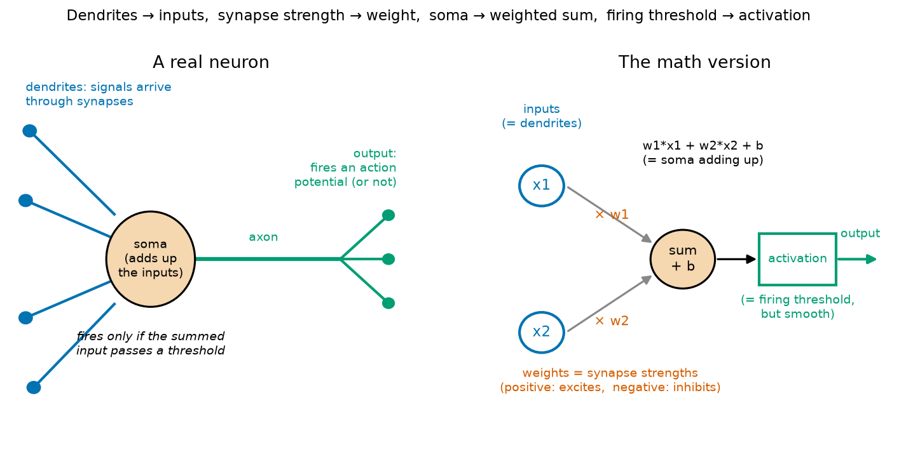
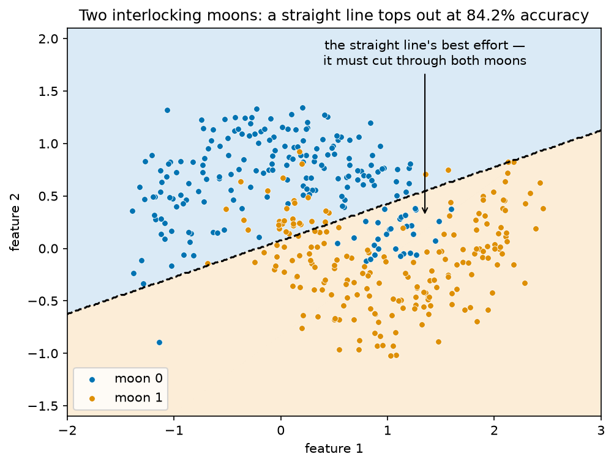
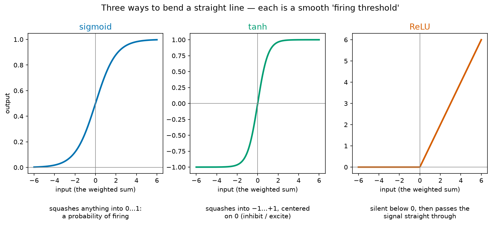
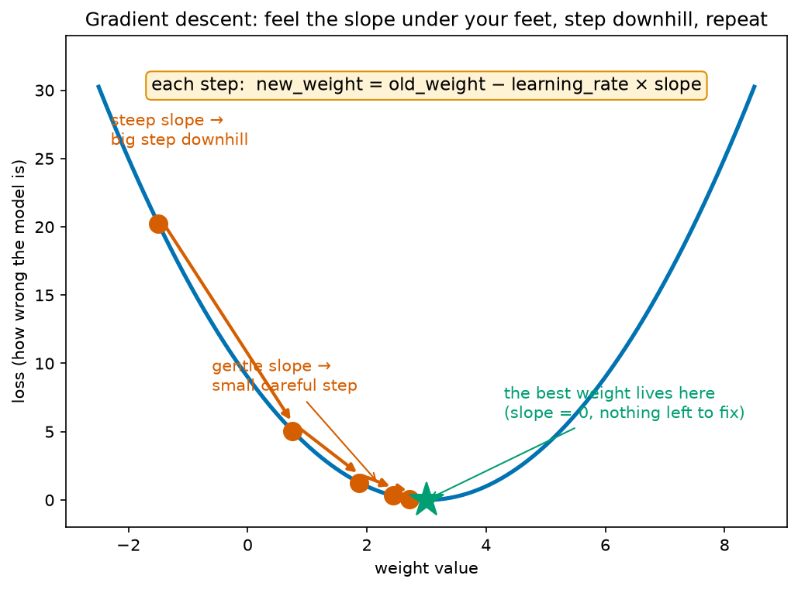
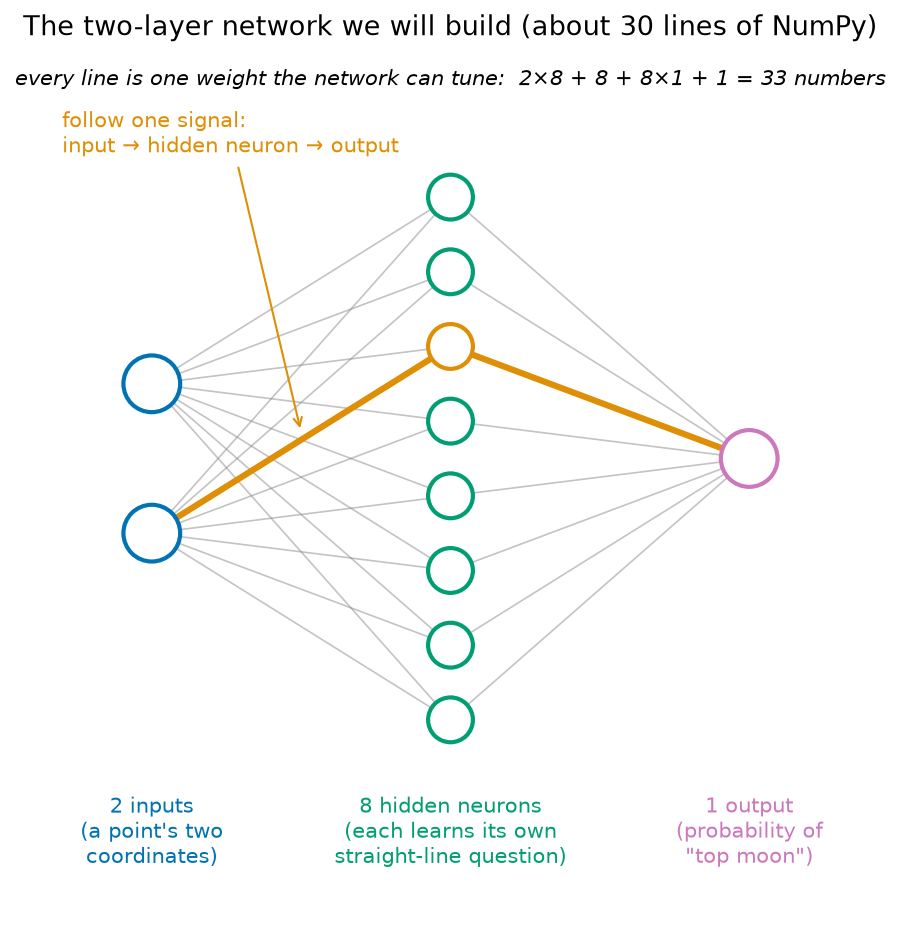

# Module 09 — Neural Networks from Scratch

*A brain cell made of math — built with nothing but NumPy.*

**Prerequisites:** [Module 01 — NumPy Foundations](../01-numpy-foundations/README.md) (arrays, shapes, vectorized math) and the earlier modeling modules — [Module 05](../05-regression-predicting-numbers/README.md) (regression and "loss"), [Module 06](../06-classification-when-accuracy-lies/README.md) (logistic regression and the sigmoid), [Module 07](../07-honest-scientist-workflow/README.md) (the honest-scientist workflow).
**Dataset:** none from HuggingFace this time — we *generate* a toy dataset called **two moons** with scikit-learn's `make_moons` (400 points, 2 features, 2 classes). This is deliberate: with only 2 features we can draw every data point *and* the model's decision boundary on one flat plot and literally watch the network learn. A real gene-expression dataset with 20,000 features would hide the one thing this module exists to show you.

## Why build one by hand?

You've run PCR. You could also just press "start" on a thermocycler and trust it. But you *understand* PCR — denature, anneal, extend — and that understanding is what lets you troubleshoot a failed reaction, design better primers, and call out nonsense when you see it.

Neural networks have thermocyclers too: PyTorch and friends will run everything for you at the press of a button (that's Module 10). This module is the "knowing what PCR actually does" step. We build a working neural network out of bare NumPy arrays — about 30 lines of real code — so that when the power tools automate it later, you'll know exactly what's being automated.

## A brain cell made of math

You know neurons better than most programmers ever will. A real neuron:

1. receives signals from other neurons through **synapses** on its **dendrites**,
2. sums those signals in the **soma** — some synapses are excitatory (push toward firing), some inhibitory (push against),
3. and if the summed input crosses a **threshold**, the **axon** fires an action potential.

An artificial neuron is a stripped-down cartoon of exactly that:



Each input gets multiplied by a **weight** — the synapse strength. A positive weight is an excitatory synapse, a negative weight an inhibitory one. The neuron adds everything up (plus a constant `b` called the **bias**, which sets how easy the neuron is to trigger — a low threshold vs a high one) and pushes the total through an **activation function**, a smooth version of "fire or don't fire":

```
output = activation(w1*x1 + w2*x2 + b)
```

**Where the analogy honestly breaks.** Don't take it further than this, because real neurons are far richer:

- Real neurons fire discrete spikes *in time* — rate and timing carry information. Our artificial neuron outputs one steady number.
- Real synapses strengthen through *local* rules (roughly, "neurons that fire together wire together"). Our network learns from a *global* error signal sent backward through the whole network — there's no strong evidence brains do backpropagation.
- A real neuron has thousands of synapses, neurotransmitter chemistry, and its own genetic program. Ours has a handful of numbers.

The artificial neuron is to a real neuron what a stick figure is to an anatomy textbook. But stick figures are useful — and this one, stacked in layers, can learn.

## The problem no straight line can solve

One artificial neuron with a sigmoid activation turns out to be *exactly* logistic regression from Module 06 — a straight-line separator that outputs probabilities. That's the punchline of the first half of the notebook: you already know what one neuron does.

So why do we need more than one? Meet the two-moons dataset:



Two crescent-shaped classes interlock like a yin-yang. Think of it as two cell populations in a 2-marker flow-cytometry plot whose clouds curl around each other: no single gate drawn with a ruler can separate them. Logistic regression tries its best and tops out around 84% — the shape of its boundary (a straight line) simply cannot match the shape of the data. We need a model that can *bend*.

## Activation functions: the bend

Here's a trap: if you stack two purely-linear layers (weighted sums feeding weighted sums), the result collapses back into one linear layer — a straight line again. Multiplying by two matrices in a row is the same as multiplying by one combined matrix; the notebook shows this numerically. Depth alone buys you nothing.

The fix is to put a **nonlinear activation function** between the layers — the mathematical version of the firing threshold:



With a bend between the layers, the network stops being one ruler and becomes a *committee* of rulers: each hidden neuron draws its own straight-line question ("are we above this line?"), and the output neuron combines their yes/no-ish answers into a curved boundary. That's the whole secret of deep learning, in one sentence.

## Learning = walking downhill in fog

How does the network find good weights? Three ideas:

1. **Loss** — a single number measuring how wrong the current predictions are. We use *binary cross-entropy*, which you can read as **surprise**: a confident correct prediction costs almost nothing, a confident *wrong* prediction ("99% sure it's moon 1" when it's moon 0) costs a fortune. Being confidently wrong is the cardinal sin.
2. **Gradient descent** — imagine the loss as a landscape over all possible weight values. You're standing on a hillside in thick fog: you can't see the valley, but you can feel the slope under your feet. Step downhill, re-check the slope, repeat.



The only formula you need:

```
new_weight = old_weight - learning_rate * slope
```

The **learning rate** is your stride length. Too small and you inch along for ages; too large and you leap clear across the valley and land higher than you started — the notebook makes both failures happen on purpose.

3. **Backpropagation** — the loss is one number, but the network has 33 weights. Which one should change, and by how much? Backprop is the bookkeeping that tells **each weight its share of the blame** for the error, by passing blame backward from the output, layer by layer (calculus's chain rule doing the accounting). Weights that contributed most to the mistake get the biggest corrections. In the notebook we implement it in a few lines; the actual derivation lives in a clearly marked *optional* aside you can skip without missing anything downstream.

## The network we'll build



Two inputs (a point's coordinates) → eight hidden neurons (the committee of rulers) → one output (the probability of "top moon"). Trained for 2000 rounds of gradient descent, it curves its boundary around the moons and beats the straight line by about 10 accuracy points. You will watch this happen frame by frame.

## What you'll learn

1. **A real neuron vs an artificial one** — the honest mapping, and where it breaks
2. **One neuron, computed by hand** — hand-picked weights classify two points with plain arithmetic
3. **One neuron is logistic regression** — the sigmoid turns a weighted sum into a probability
4. **Two moons: where a straight line fails** — plot the data, fit logistic regression, watch it lose
5. **Activation functions** — sigmoid, tanh, ReLU; and the numeric proof that stacked linear layers collapse into one
6. **Loss as surprise** — binary cross-entropy, and why it punishes confident wrongness
7. **Gradient descent on a 1-D bowl** — implement the update loop on `(w - 3)^2`, watch the ball roll; then make the learning rate too big and watch it explode
8. **Build the network** — `forward`, `loss`, `backward`, `update` as four plain functions (with the optional chain-rule aside)
9. **Train it** — 2000 epochs, loss curve falling
10. **The filmstrip** — decision boundary at epochs 0 / 100 / 500 / 2000, curving itself around the moons
11. **Final score** — the network vs the straight line
12. **Learning-rate experiments** — 0.01 / 1.0 / 10 on the same network: crawl, cruise, chaos

## How to work through it

```bash
source ../../.venv/bin/activate
jupyter lab notebook.ipynb
```

Run each cell in order, predicting outputs first. Then do [exercises.md](exercises.md).

## The one idea to remember

> **A neural network is a committee of tiny straight-line questions, bent by activation functions and tuned by blame.**
> Each hidden neuron asks one linear question; the activation bends the answers; gradient descent walks downhill on the loss; backprop tells every weight its share of the blame. Everything in deep learning — up to and including GPT — is this loop, scaled up.
