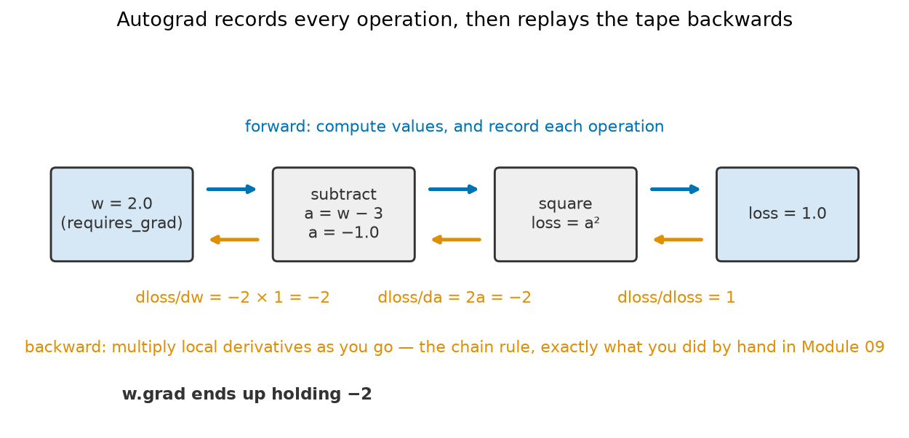
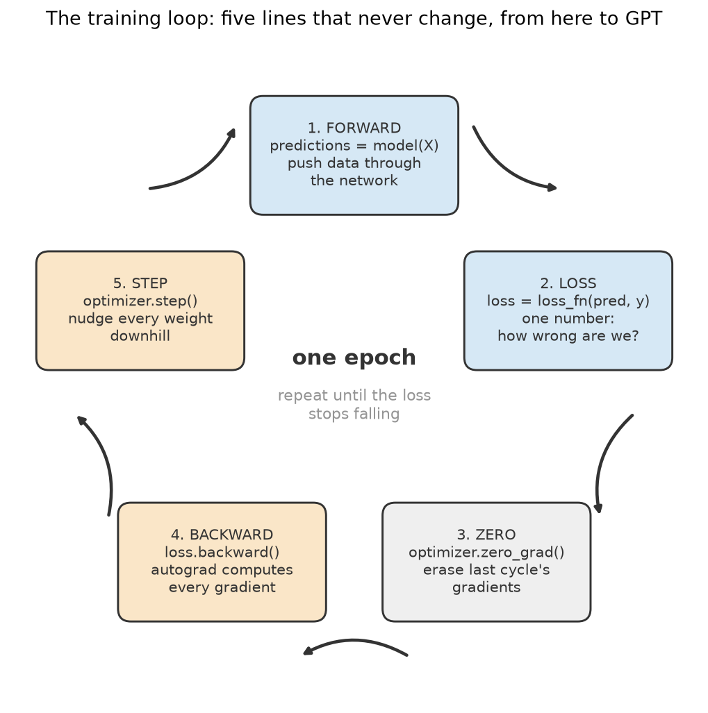
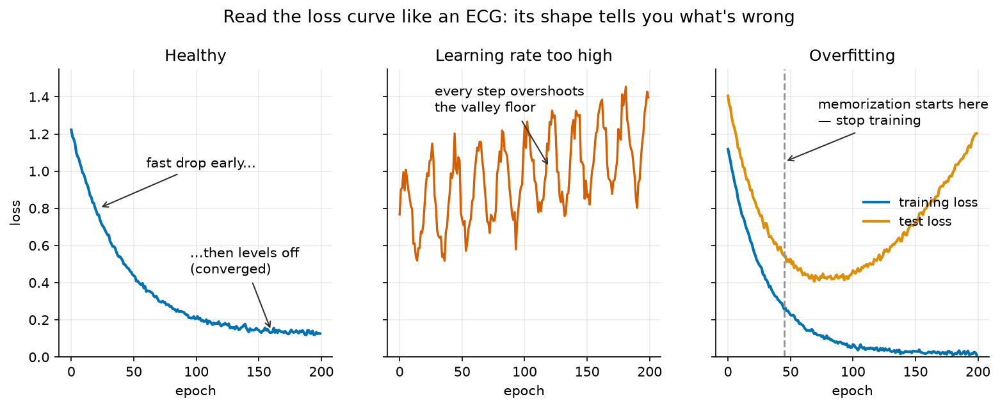

# Module 10 — PyTorch Fundamentals

*Everything you built by hand in Module 09 — the weights, the chain rule, the downhill steps — handed to power tools.*

**Prerequisites:** [Module 09 — Neural Networks from Scratch](../09-neural-networks-from-scratch/README.md) (we rebuild its network line for line). Helpful callbacks to [Module 06 — Classification](../06-classification-when-accuracy-lies/README.md) (the heart-disease patients, random forests) and [Module 07 — The Honest-Scientist Workflow](../07-honest-scientist-workflow/README.md) (fit the scaler on training data only).
**Dataset:** [Heart Disease](https://huggingface.co/datasets/buio/heart-disease) from HuggingFace — the same 303 Cleveland Clinic patients from Module 06: 13 clinical measurements each, predicting whether the patient has heart disease. Plus scikit-learn's `make_moons` toy data for the rebuild.

## From hand-pipetting to the thermocycler

In Module 09 you ran PCR by hand: you made the weight matrices yourself with `np.random`, derived every gradient with the chain rule on paper, and wrote the downhill update yourself. That was the point — now you know what's actually happening.

Nobody does it that way twice. **PyTorch** is the thermocycler: the same reactions, automated, reliable, and scaled. Every piece of Module 09 has an exact PyTorch counterpart, and this module's whole job is to show you the mapping:

| You built by hand (Module 09) | PyTorch gives you |
|---|---|
| `np.array` of inputs | **tensor** (a NumPy array that remembers its math) |
| `W1`, `b1`, `W2`, `b2` made with `np.random` | `nn.Linear(2, 8)` stores a weight matrix and bias vector for you |
| the chain rule, derived on paper | **autograd**: `loss.backward()` computes every gradient |
| `W = W - learning_rate * gradient` | `optimizer.step()` |
| your hand-written training loop | the same loop — five lines that never change |

## Autograd: the chain rule, automated

The single biggest gift is **autograd** (automatic gradients). When you compute with tensors, PyTorch quietly records every operation, like a lab notebook that writes itself. Ask for `loss.backward()` and it replays the notebook *backwards*, multiplying local derivatives as it goes — the chain rule from Module 09, executed by machine.



In the notebook we run exactly this tiny example — `loss = (w − 3)²` at `w = 2` — and check that PyTorch's answer matches the derivative you'd compute by hand (`2 × (w − 3) = −2`). It does, to the digit. From then on you can trust it with networks of millions of weights, where doing the chain rule by hand would take a lifetime.

## The training loop liturgy

Training in PyTorch is a five-line ritual, and it is worth memorizing like a protocol card taped above the bench. Like a PCR cycle (denature → anneal → extend, repeat), the steps never change — only the ingredients do. The loop you write today for 303 patients is, line for line, the loop that trains GPT.



One full pass through the cycle over all the training data is an **epoch**. The only step that surprises people is `zero_grad()`: PyTorch *adds* new gradients onto old ones by default, so you must wipe the slate each cycle — like emptying the waste beaker before the next run.

## Watching training: the loss curve is your ECG

You never watch a network think; you watch its **loss curve** — the loss value plotted after every epoch. Its shape is a diagnostic trace, and you'll learn to read it the way a cardiologist reads an ECG:



The third panel is the important one for this module. When we train on the heart patients, the training loss falls forever — but the *test* loss falls, bottoms out, and climbs back up. That turning point is the moment the network stops learning medicine and starts **memorizing its 225 training patients**, like a student memorizing the answer key instead of the material. You will see this happen live, and catch the exact epoch.

## An honest ending

After the network trains on the heart patients, we run Module 06's random forest on the *same* train/test split. Spoiler: on 303 patients the forest ties the neural network. That is not a failure — it's the honest lesson of this module. Deep learning's superpower is scaling with **lots** of data; a few hundred rows of tabular data is random-forest country. Module 11 hands the network 70,000 images, which is where it starts to earn its reputation.

## What you'll learn

1. **Tensors** — NumPy arrays round-trip (`torch.from_numpy`, `.numpy()`), and the float64 vs float32 gotcha
2. **Autograd** — `requires_grad=True`, `loss.backward()`, `w.grad`, checked against the by-hand chain rule
3. **The network as a parts list** — `nn.Sequential`, `nn.Linear`, counting the 33 learnable parameters, and the map back to Module 09's `W` and `b` arrays
4. **The training loop liturgy** — forward → loss → `zero_grad` → `backward` → `step`, on the two-moons data, ending in the same curved decision boundary Module 09 earned by hand
5. **DataLoader** — why we feed data in batches, `TensorDataset`, and what one batch looks like
6. **A real problem** — the 303 heart patients: preprocessing (scaler fit on train only), a small network, and the train-vs-test loss curves where you spot overfitting starting
7. **The honest comparison** — the same split, a random forest, and the "deep learning needs data" lesson
8. **Devices** — timing a big matrix multiply on the CPU vs the Apple GPU (`"mps"`), and why the lesson itself stays on CPU

## How to work through it

```bash
source ../../.venv/bin/activate
jupyter lab notebook.ipynb
```

Run each cell in order, predicting outputs first. Then do [exercises.md](exercises.md).

## The one idea to remember

> **The five-line training loop never changes.**
> Forward → loss → `zero_grad()` → `backward()` → `step()`. Whether it's 33 parameters learning two moons or a trillion parameters learning language, it is the same ritual — only the model, the data, and the patience differ.
