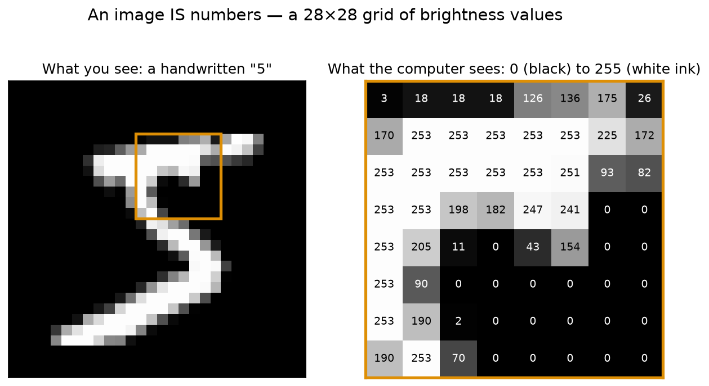
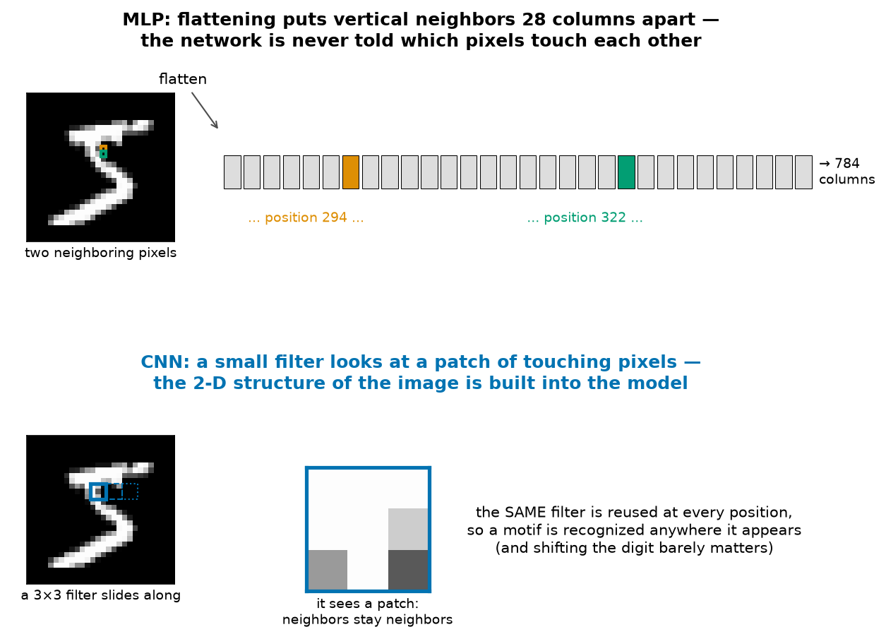
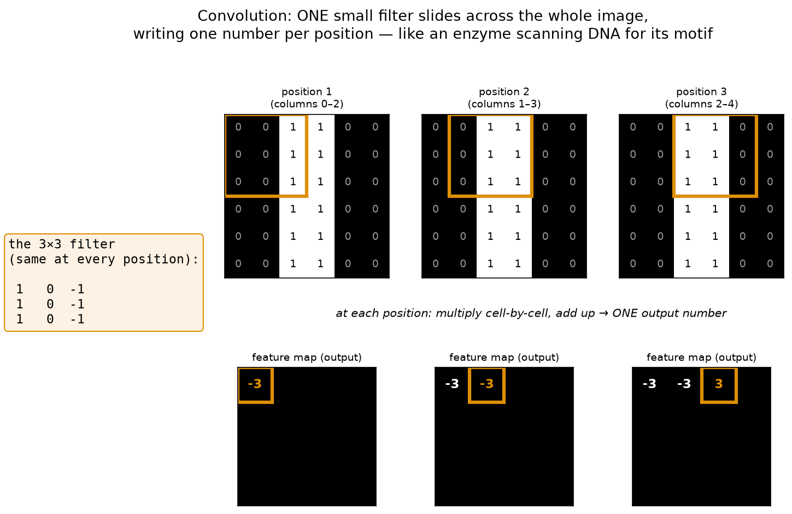
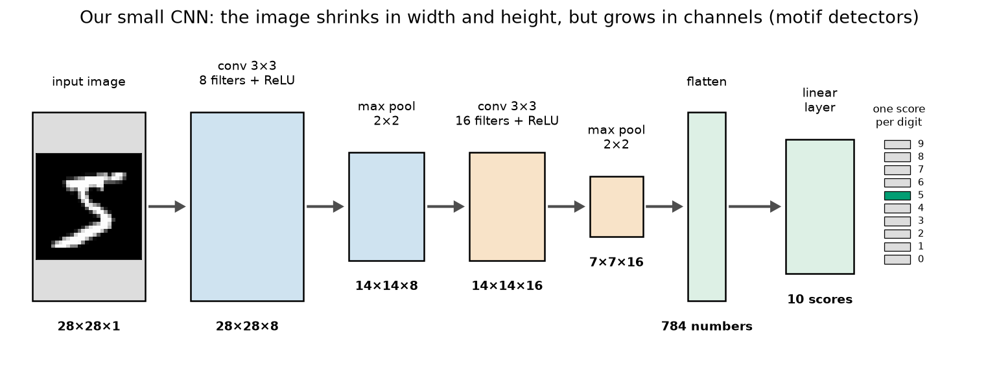

# Module 11 — Deep Learning on Images

*How a network learns to see.*

**Prerequisites:** [Module 10 — PyTorch Fundamentals](../10-pytorch-fundamentals/README.md) (we reuse its training loop unchanged: forward → loss → `zero_grad` → `backward` → `step`).
**Dataset:** [MNIST](https://huggingface.co/datasets/ylecun/mnist) from HuggingFace — 70,000 handwritten digits (0–9) collected by the US Census Bureau and American high-school students, each scanned as a tiny 28×28 grayscale image.

## The fruit fly of deep learning

Biology has model organisms: *Drosophila* is small, cheap, fast to breed, and everything we first learned about genes was worked out on it before anyone touched a mouse. Machine learning has model *datasets*, and MNIST is its fruit fly: 70,000 handwritten digits, small enough to train on a laptop in minutes, real enough that every idea in this module — convolution, pooling, feature maps, confusion matrices — shows up exactly the way it does on medical images. We do our genetics on the fly first; the mouse (real microscope images of malaria-infected blood cells) is the capstone project.

## An image is just numbers

Your retina doesn't send "a five" to your brain — it sends a grid of light intensities, and the *seeing* happens downstream. Same here. A grayscale image is a grid of numbers, one per **pixel** (picture element): 0 means black, 255 means the brightest white. That's the whole secret. Everything a neural network does with an image, it does to a grid of numbers.



*Left: the image as we see it. Right: an 8×8 patch of the same image as the computer sees it — just brightness values. Before training we divide everything by 255 so values run from 0 to 1 (**normalization** — same idea as the feature scaling you've met before: keep all inputs in a comparable, small range so the gradients behave).*

## The obvious first move — and its blind spot

Module 10's network (an **MLP**, multi-layer perceptron — the plain stack of linear layers and ReLUs) wants a flat list of input features. So the obvious move is to unroll the 28×28 grid into 784 columns and train on that. It works surprisingly well — about 96% on digits it has never seen.

But look at what flattening *destroys*:



To the MLP, pixel (10, 14) and the pixel directly *below* it are just "column 294" and "column 322" — as unrelated as bill length and body mass were in the penguin table. The network is never told which pixels touch each other, so it can't learn the concept of a *shape*; it learns "this exact column tends to be bright when the label is 5." In the notebook we expose this with one line of NumPy: shift every test digit two pixels to the right, and the MLP's accuracy collapses. Every pixel moved to a different column, so to the MLP it's an entirely different input — even though any human (and any CNN) still sees the same digit.

## Convolution: a motif scanner

Here is the idea that fixed computer vision, and it will feel familiar. A **restriction enzyme** like EcoRI doesn't read a genome position-by-position with a separate rule for each position — it has *one* recognition motif (GAATTC) and slides along the DNA, cutting wherever the motif appears. The motif is recognized *anywhere* it occurs.

A **convolution filter** is exactly that, for images. It's a tiny grid of learned weights — ours are 3×3 — that slides across the image. At each position it multiplies its 9 weights by the 9 pixels underneath, adds them up, and writes one number: "how strongly does my motif appear right here?" The result, collected over all positions, is a **feature map** — a picture of *where the motif was found*, like a gel showing where the enzyme cut.



*The filter shown responds to vertical edges (bright on the left of it, dark on the right). In the notebook you'll build this exact filter and slide it over a real digit with plain Python loops — no PyTorch magic — so you can see there is nothing inside a convolution but multiply-and-add.*

Two consequences, both huge:

1. **Shift tolerance.** Because the *same* filter is reused at every position, a motif is detected wherever it appears. Shift the digit; the feature map shifts with it, but the motif is still found. This is exactly the blind spot of the MLP, cured.
2. **Almost no parameters.** One 3×3 filter is 9 weights + 1 bias, reused across all 784 positions. The MLP needed a separate weight for every pixel × every neuron.

**Pooling** is the companion trick: after each convolution we shrink the feature map by keeping only the strongest response in each 2×2 block (**max pooling**). It's deliberate summarization — "there was a vertical edge in this general region" — which halves the width and height, and makes the network care even less about exact pixel positions.

## The CNN

Stack it up: convolve, activate, pool, twice — then flatten what's left and let one small linear layer turn it into 10 scores. That's a **convolutional neural network** (CNN).



*Notice the shape story: spatial size shrinks (28 → 14 → 7) while the number of **channels** — parallel motif detectors — grows (1 → 8 → 16). Early filters learn simple motifs (edges, strokes); the second layer sees combinations of those motifs (corners, loops). By the end the network isn't looking at pixels any more, it's looking at "loop at the top, straight stroke below" — which is how you'd describe a 9 to another person.*

In the notebook you'll train this CNN and compare it to the MLP on both accuracy *and* parameter count — the CNN wins while being about ten times smaller. Then we open it up: draw the 8 learned first-layer filters, push one real digit through and look at its feature maps, and read the **confusion matrix** (a 10×10 table of which true digit got which prediction) to see whether the machine's mistakes — 4↔9, 3↔5 — are the same ones a tired human would make. Finally we starve the network of data on purpose to make it **overfit** (memorize the training set instead of learning the pattern) and meet **dropout**, the standard medicine.

## What you'll learn

1. **Load MNIST and look at it** — always look at the raw data first, images included
2. **A digit is just numbers** — zoom into the 28×28 grid, normalize to 0–1
3. **Baseline: flatten + MLP** — Module 10's network on 784 columns (~96%)
4. **The MLP's blind spot** — shift a digit two pixels and watch the prediction break
5. **Convolution by hand** — a 3×3 edge filter, plain loops, a feature map
6. **Pooling** — shrink but keep the strongest signal
7. **Build the CNN** — and print the tensor shape after every layer
8. **Train it** — beat the MLP with ~10× fewer parameters
9. **Look inside** — learned filters and feature maps for a real digit
10. **The confusion matrix** — which digits get confused, and are the mistakes human-like?
11. **Overfitting and dropout** — train/test curves on a starved network
12. **Where next** — the malaria-detector capstone

## How to work through it

```bash
source ../../.venv/bin/activate
jupyter lab notebook.ipynb
```

Run each cell in order, predicting outputs first. Then do [exercises.md](exercises.md).

## The one idea to remember

> **A convolution filter is a restriction enzyme for images.**
> One small motif detector, slid across the whole input, reporting everywhere its motif occurs. That single trick — look for local patterns, and look for them *everywhere* — is why the CNN beats a network ten times its size, and it's the same trick behind every image model from digit reading to tumor screening.
