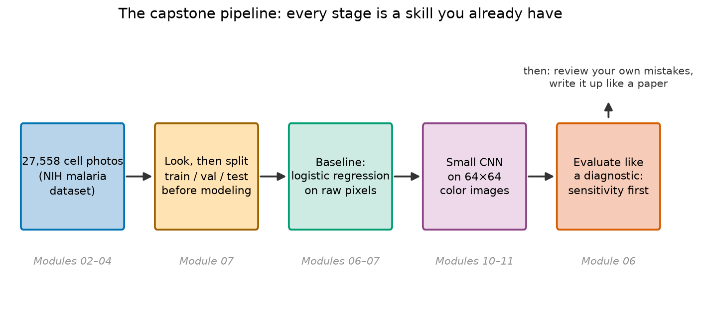
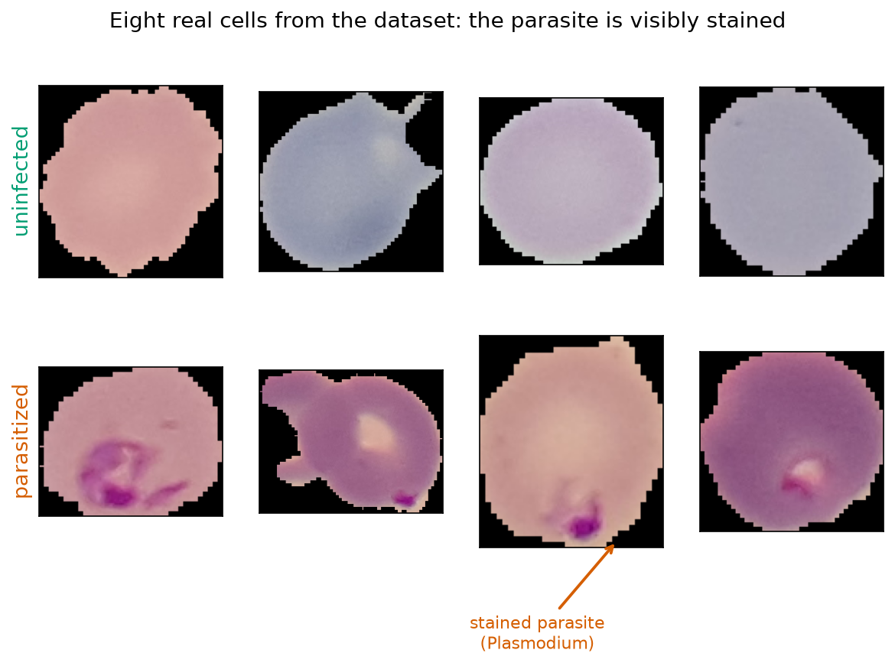
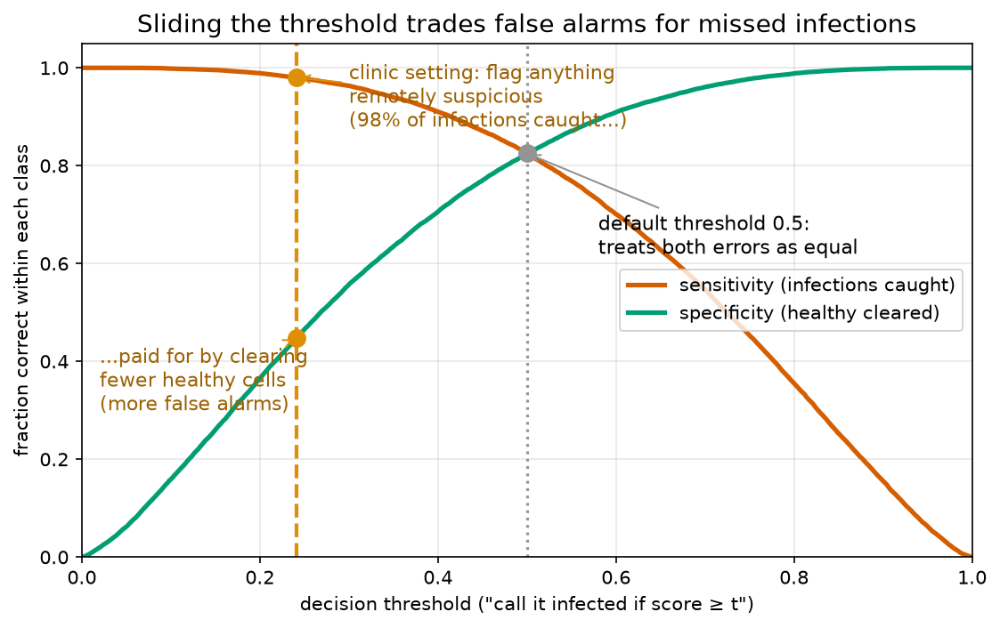

# Capstone Project 01 — The Malaria Detector

*Every skill from Modules 01–11, aimed at one real diagnostic problem.*

> **This is a project, not a module — the rules are different.**
> This README is a **project brief**: it tells you *what* to build at each stage and *where you learned how*, but not the steps. Work through each stage in your own fresh notebook first. The included [notebook.ipynb](notebook.ipynb) is a **worked solution — one possible answer, not the answer** — open it only after you've attempted a stage yourself (or when you're truly stuck).

**Prerequisites:** all of it, really — especially
[Module 02](../../modules/02-pandas-essentials/README.md) · [Module 04](../../modules/04-first-machine-learning/README.md) · [Module 06](../../modules/06-classification-when-accuracy-lies/README.md) · [Module 07](../../modules/07-honest-scientist-workflow/README.md) · [Module 10](../../modules/10-pytorch-fundamentals/README.md) · [Module 11](../../modules/11-deep-learning-on-images/README.md).
**Dataset:** [dpdl-benchmark/malaria](https://huggingface.co/datasets/dpdl-benchmark/malaria) — the NIH malaria dataset: 27,558 photos of single red blood cells, segmented from thin blood-smear slides photographed at Chittagong Medical College Hospital, Bangladesh; half the cells are parasitized with *Plasmodium*, half are uninfected.

## The mission

Malaria still kills roughly 600,000 people a year. The diagnostic gold standard is over a century old and beautifully simple: smear a drop of blood on a slide, stain it with Giemsa (which dyes parasite chromatin purple), and have a trained microscopist scan it for infected red blood cells. The catch is the phrase *trained microscopist* — examining one slide properly means inspecting hundreds of cells, and the rural clinics that see the most malaria have the fewest experts.

Your job: build the prototype of a tool such a clinic could use — a classifier that takes the photo of a single red blood cell and flags it as **parasitized** or **uninfected**, tuned the way a screening test should be tuned (miss as few real infections as possible; a human re-checks whatever the model flags).



Nothing in this pipeline is new. That's the point of a capstone: you've done every stage before, just never in one continuous investigation on data this real.

## Ground rules

- Work in a fresh notebook of your own inside this folder (e.g. `my_attempt.ipynb`).
- **Laptop budget:** the full dataset is 27,558 images. Subsample — the solution uses **6,000 train / 1,000 val / 1,500 test**, stratified, with `random_state=42` and `torch.manual_seed(42)`. Use the same numbers if you want your results to be comparable to the worked solution.
- Resize images to **64×64** for the CNN (and smaller still for the baseline). Whole solution runs in a few minutes on CPU.
- The stages below each say *"you learned this in Module NN"*. If a stage feels impossible, that's your cue to revisit the module — not to open the solution.

---

## Stage 1 — Look at the data *(Modules 02–04)*

Before any modeling: the first-look ritual, adapted from tables to images.

**Produce:** how many images, class balance, a grid of sample photos from *both* classes, and a check of image sizes (are they all the same? does it matter?).

**A twist worth savoring:** the dataset's `label` column is a bare integer — and the documentation doesn't say which number means parasitized. **Do not guess.** You are a biologist: Giemsa stains *Plasmodium* chromatin dark purple. Put labeled samples of each class side by side and read the answer off the cells themselves, then document the mapping with your evidence.



As a biologist, say out loud what *you* use to tell the classes apart — you're about to ask a machine to discover the same feature.

## Stage 2 — An honest protocol *(Module 07)*

Split **before** any modeling: train / validation / test, stratified, seed 42. The test set gets touched **exactly once**, at the end of Stage 5 — every decision along the way (architecture, epochs, threshold) is made on validation data only. This is sterile technique for data: decide your controls before the experiment, not after you've seen the results.

**Produce:** the three index sets, with printed sizes and per-split class balance proving the stratification worked.

## Stage 3 — Baseline first *(Modules 06–07)*

Before a neural network earns its complexity, ask the control question: *would a simple rule do?* Fit **logistic regression on raw pixels**: shrink each image small (the solution uses 32×32 color), flatten it to one long row of numbers, scale the columns (fit the scaler on train only — you know why), and fit.

**Produce:** train and validation accuracy, and — this matters — a sentence explaining *why* the baseline scores what it scores. Think about what "one weight per pixel position" means when the parasite can sit anywhere in the cell.

## Stage 4 — The CNN *(Modules 10–11)*

Now the tool built for images: a small convolutional network on the 64×64 color photos — the Module 11 recipe (conv → pool, a few times, then dense), a single sigmoid output for P(parasitized), and the Module 10 training-loop liturgy with per-epoch train/validation metrics.

**Produce:** the architecture, the training loop, printed per-epoch metrics, and a **loss-curve plot** (train + validation). Read the curves before moving on: still learning? memorizing yet?

## Stage 5 — Evaluate like a diagnostic *(Module 06)*

Now — and only now — the test set, for both models at once. Accuracy alone is not enough for a medical tool; in a clinic the two errors are not symmetric. A **false positive** costs a re-check. A **false negative** sends an infected patient home.

**Produce:**

- Confusion matrix on the test set; **sensitivity** and **specificity**, in those words.
- The threshold question: 0.5 treats both errors as equal — a clinic shouldn't. Using **validation data** (choosing a threshold is a decision, and decisions don't belong to the test set), find the threshold that reaches **~98% sensitivity**, then report what it costs in specificity on the test set.
- A **ROC curve** with both operating points (default 0.5 and clinic threshold) marked.



The two operating points sit on the same curve — the model is identical; the *threshold* encodes the clinical judgment about which mistake is worse.

## Stage 6 — Be your own reviewer

Every reviewer of a diagnostics paper asks: *show me the failures.* Pull the test cells your model gets wrong at the clinic threshold — **false negatives especially** — and display them sorted by how confidently wrong the model was.

**Produce:** a grid of the worst mistakes, plus your hypotheses *as a biologist* for each pattern you see (faint early-ring stains? parasites at the cropped cell edge? debris on healthy cells?). Then write an honest **limitations paragraph**: one hospital, one staining protocol, pre-segmented single cells rather than whole slides, expert labels taken on faith, and no clinical validation of any kind.

## Stage 7 — Write it up

Condense the whole investigation into a short **methods-and-results summary** in the style of a paper abstract: Background, Methods (data, splits, models, seeds), Results (real numbers: baseline vs. CNN, sensitivity/specificity at both thresholds), Limitations. If it doesn't fit in ~150 words, you haven't found the story yet. The worked solution ends with a fill-in template for yours.

---

## How to work through it

```bash
source ../../.venv/bin/activate
jupyter lab
```

Create your own notebook and work stage by stage, revisiting the linked modules when stuck. Only then open [notebook.ipynb](notebook.ipynb) — **try each stage yourself first; that notebook is one possible answer** — and compare choices, not just numbers: where did your protocol differ, and does the difference matter?

## The one idea to remember

> **The model is the easy part.**
> What makes this a *diagnostic* is everything around the model: an honest split, a baseline control, sensitivity chosen over accuracy, a threshold set by clinical priorities, and a failure review done with a biologist's eye. That workflow — not the CNN — is what you spent eleven modules learning.
